# Lab 1 - Introduction to DE10-Lite & Quartus

## The DE10-Lite FPGA Board

The first thing I did was connect the DE10-Lite board to my machine using the USB cable. The LEDs on the board turned on and cycled through a pattern, and the 7-segment display cycled through through the hex digits `0` to `F`.

The FPGA chip is 10M50DAF484C7G.

## Task 0 - Preparation

### Creating a Good Directory Structure

In preparation for this lab and future labs, I created the following directory structure for the labs:

```
├── parent_dir
    ├── lab1
    │   ├── task1
    |   │   ├── task1_top.sv
    |   |   └── others.sv
    │   ├── task2
    │   ├── ...
    |   └── mylab
    ├── lab2
    ├── lab3
    └── lab4
```
This will help to keep all the files associated with the lab organised.

### Setting Up Programming Hardware

Next, I ran Quartus and navigated to `Tools -> Programmer -> Hardware Setup`. I then ensured that the USB-Blaster was selected as the hardware device. This is to tell Quartus that we are using the DE10-Lite interface to program (blast) the FPGA.

### Blasting the FPGA

I then navigated to the directory containing the `lab1task1_sol.sof` file and added this file to the Programmer. The Programmer tool is where we select the configuration file to needed to load (blast) our design onto the FPGA device. 

The `lab1task1_sol.sof` file contains the bitstream to configure (or programme/blast) the FPGA MAX10 chip.

The bitstream programs the LUTs (Look-Up Tables), connects logic blocks together, sets Flip-Flop and memory behaviour, and assigns I/O pins.

Once the bitstream has successfully blasted the FPGA chip, the FPGA behaves as defined by the design.

In this case, the `lab1task1_sol.sof` file programmed the FPGA such that changing the least significant four switches  (SW0-SW3) changed the hexadecimal number displayed on the rightmost 7-segment display (HEX0).
For example, when all the switches were in the down position, the hex number displayed was `0` and when all switches were in the up position, the number displayed was `F`.

Also note the configuration is volatile, meaning it will be lost when the power turns off.

## Task 1 - Design Flow: 7-Segment LED Display

In Task 0, we saw how to setup the programming hardware and blast the FPGA. We now want to create the design used above from scratch.

### Creating the Project

In Quartus, I first created a New Project in my working directory: `InfoProc/lab1/task1`. I then called the name of the project `task1` and the top-level design entity I called `task1_top`.

### Device Assignment

 Next, I had to select the device I wanted to target for compilation which is the 10M50DAF484C7G MAX 10 chip used in DE10. I did this in the `Assignments -> Device` menu.

Interpreting the device code, `10M` corresponds to the MAX 10 family, `50` is the size of the device (~50,000 logic elements), `484` is the number of pins and `C7` is the speed grade.

### Creating the Verilog Specification

Next, I wanted to create the Verilog specification for the design. I created a new Verilog HDL design file for the decoder module and saved it as `hex_to_7_seg.v`.
This was the Verilog code I wrote:
```verilog
module hex_to_7seg (out, in);
	
	output	[6:0] out;		// low-active output
	input 	[3:0] in;		// 4-bit binary input
	
	reg		[6:0] out;
	
	always @ (*)
		case (in)
			4'h0: out = 7'b1000000;
			4'h1: out = 7'b1111001;		//  --0--
			4'h2: out = 7'b0100100;		//  |   |
			4'h3: out = 7'b0110000;		//  5   1
			4'h4: out = 7'b0011001;		//  |   |
			4'h5: out = 7'b0010010;		//  --6--
			4'h6: out = 7'b0000010;		//  |   |
			4'h7: out = 7'b1111000;		//  4   2
			4'h8: out = 7'b0000000;		//  |   |
			4'h9: out = 7'b0011000;		//  --3--
			4'ha: out = 7'b0001000;
			4'hb: out = 7'b0000011;
			4'hc: out = 7'b1000110;
			4'hd: out = 7'b0100001;
			4'he: out = 7'b0000110;
			4'hf: out = 7'b0001110;
		endcase
endmodule
```

This Verilog code converts the 4-bit binary input `in` representing a hex digit `0x0 to 0xF`, into a 7-segment display output `out`. The `out` signal is a 7-bit value where each bit controls one segment of the display. In this code, the output is low-active, meaning the segments are turned on by setting the corresponding bit of `out` to `0`.

For example, to display the digit `8`, all segments must be on, as shown by the case statement: `4'h8: out = 7'b0000000;`.
To display the hex digit `C`, all segments except for segments 1, 2 and 6 must be on, hence the case statement: `4'hc: out = 01000110`. The below image shows how each input corresponds to each digit:

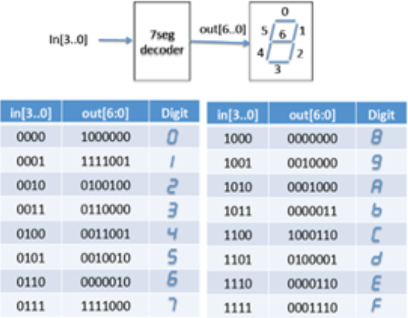


The keyword `reg` in Verilog stands for register and is used to declare a variable that holds its value across simulation cycles (i.e. it can store a value and retain it until updated). Here, `out` is declared as a `reg` as it holds the value of the 7-segment display and changes based on the input `in`.

The `always` keyword starts a block that contains logic that is executed when certain conditions change.
These conditions are outlined in the sensitivity list `@ (*)`. In this case, the block is triggered whenever any of the signals inside the block change (in this case, `in`) which is denoted by `(*)`.

### Analysing & Checking the File

After writing some code, it is good practice to check the syntax of the code by clicking 'Analyse Current File'. This is very useful in the interest of saving time and to make sure the new Verilog module is error-free.

I also made sure to save the file and then I added the file to the project to include the module in my design.

### Creating the Top-Level Specification in Verilog

We also need to create a top-level (at chip level) design for the decoder module. This top-level design is needed to connect the external inputs (the switches `SW`) and external outputs (7-seg display `HEX0`) to the module we wrote above, `hex_to_7seg.v`.

I named my top file `task1_top.v` and this was the code I wrote for it:

```verilog
module task1_top (
	input   [3:0] SW,        // 4-bit input switches
	output  [6:0] HEX0       // hex output on 7-segment display
);

hex_to_7seg SEG0 ( 			 // instantiate the hex_to_7seg module
	.in(SW[3:0]),
	.out(HEX0)
);

endmodule
```

I then specified that this is our top-level design in `Project -> Set as Top-Level Entity`.

I then clicked 'Analyse Current File' to check the syntax and then I clicked 'Start Analysis & Elaboration` to verify everything so far works properly. Both of these ran with no errors.

**Important Point**: Every time we create a new entity or module as part of the design, we must include the file in the project via `Project -> Add/Remove Files to Project`.

### Pin Assignment

Next, we need to associate the design with the physical pins of the MAX 10 FPGA on the DE10 board.
To assign pins manually, we navigate to `Assignment -> Pin Planner` where we can view the chip package diagram and the top-level input and output ports. In our design, we are using 11 pins (`HEX0[0]`-`HEX0[6]` and `SW[0]`-`SW[3]`) but for the purposes of learning how the manual pin assignment works, I only manually inputted the fields for `HEX0[6]` and `SW[3]`.

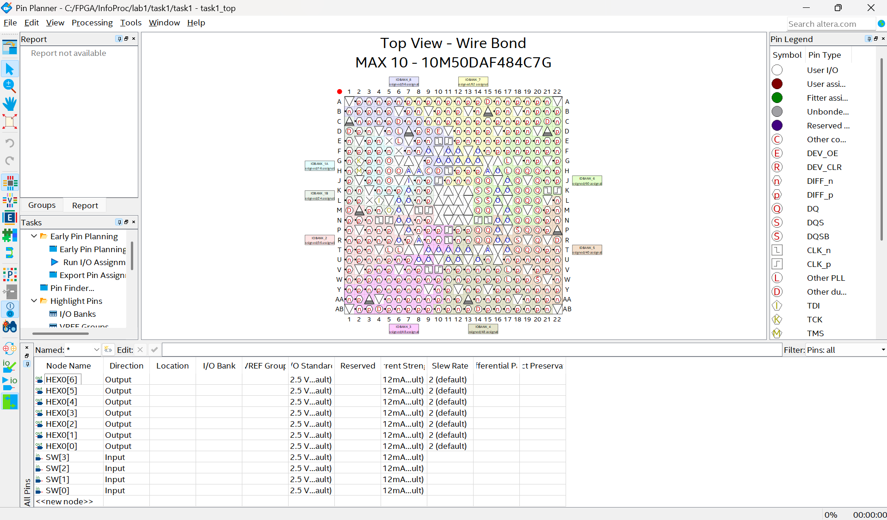


For the 'Location' field, I set `HEX0[6]` to `PIN_C17` and `SW[3]` to `PIN_C12`. For the I/O Standard field, I set `HEX0[6]` and `SW[3]` to `3.0-V LVTTL`.

The I/O Standard defines the voltage level and electrical characteristics.

I then closed the pin assignment window and opened the `.qsf` file in my directory (`qsf` = Quartus Setting File). As a result of the manual pin assignment steps, we see these 4 lines at the bottom of the file which defines the physical pin location and voltage standard we specified for the ports:

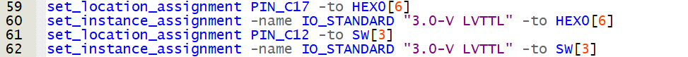


It is clear that manual pin assignment is laborious and prone to errors, so it is much better to insert a text file with the necessary information directly into the `.qsf` file. I then deleted the 4 lines above that were created through the manual pin assignment and inserted the `pin_assignment.txt` provided, in which **all** the pins used on the DE10 are assigned.

### Compiling the Design & Programming the FPGA

Now the pins are assigned, we can compile our design. This performs all the steps of compilation, placement, routing, fitting etc. and produces a bitstream file (`.sof`) which is ready to blast onto the FPGA.

After successful compilation, this was the flow summary that was shown:

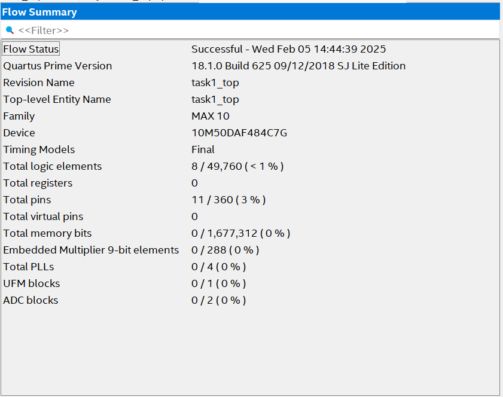


From this, we can see that the design uses 8 logic elements (out of nearly 50,000) and 11 pins as we expect. 

Finally, I programmed the DE10 with my design by navigating the the `Tools -> Programmer` window and adding the `task1_top.sof` file which I found in the `lab1/task1/output_files` directory.

As in lab0, changing switches `SW0-SW3` changed the HEX digit displayed on the 7-segment display:

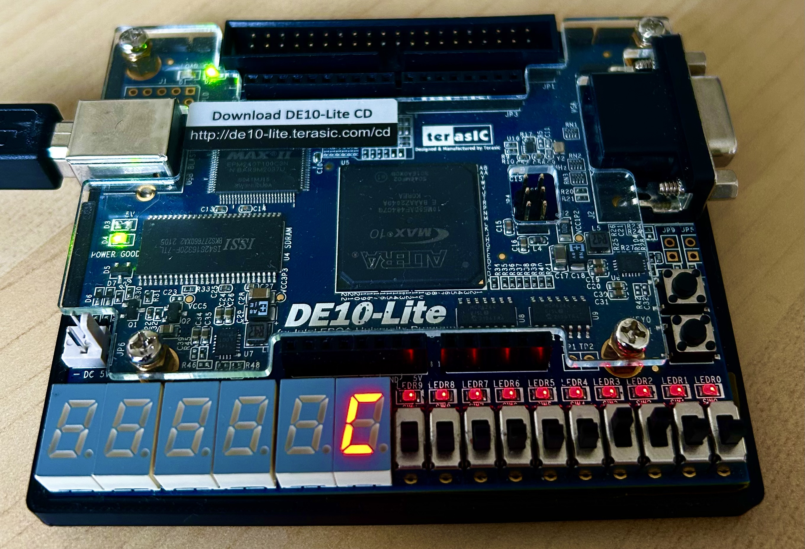

## Task 2 - Netlist Viewer & Timing Analyser

### RTL Viewer

Quartus provides a graphical view of the synthesised design. Viewing this is useful as it provides insight into how the Verilog code is turned into actual FPGA hardware.

I first looked at the RTL Viewer which can be found via `Tools -> Netlist Viewers -> RTL Viewer`. RTL Viewer allows us to visualise the Register Transfer Level (RTL) representation of the design. It is useful for verifying that the Verilog code written for the design is correctly translated into gates, flip-flops and MUXs.

This is the top-level view of the design:

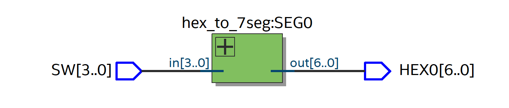

Pushing down into this block, this is displayed:

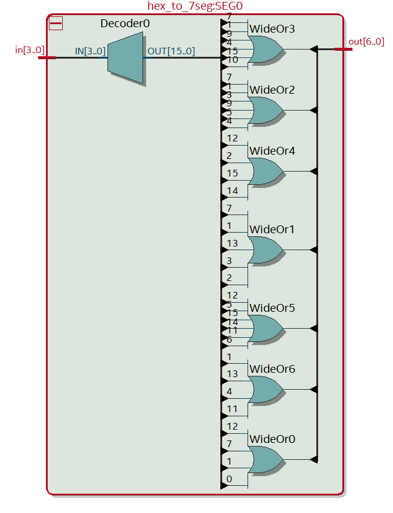

The decoder is a one-hot decoder that maps each possible 4-bit input to a unique bit pattern in `OUT[15:0]`. For example, the input `in[3:0]=4'h6` maps to `OUT[15:0]=15'b0000 0000 0100 0000`, that is, only bit `6` of `OUT[15:0]` is a `1`. Similarly, `in[3:0]=4'h0` maps to `OUT[15:0]=15'b0000 0000 0000 0001`, where only bit `0` of `OUT[15:0]` is a `1`. 

Continuing with the example of `in[3:0]=4'h6`, we see that bit `6` of `OUT[15:0]` is fed into `WideOr5` only. As all other bits of `OUT` will be `0`, only the output of `WudeOr5` will be a `1`, all others will be `0`. Since `out[6:0]=7'b0000010` (remembering the 7-seg display uses active-low logic), the output of `WideOr5` corresponds to bit `2` of the output and hence segment `1` of the display. Therefore, only segment `1` of the 7-segment display will be off, and hence we will see the number `6`.

Looking at the other examples, we can conclude this:

```csharp
out[6] = WideOr0
out[5] = WideOr1
out[4] = WideOr2
out[3] = WideOr3
out[2] = WideOr4
out[1] = WideOr5
out[0] = WideOr6
```
Confirming this with another example, take the input `in[3:0]=1100` which corresponds to the hex digit `C` and decimal digit `12`. The output of the decoder, `OUT[15:0]=16'b0001 0000 0000 0000` (only bit `12` is a `1`), and looking at the above diagram, `OUT[12]` is an input to `WideOr0`, `WideOr4` and `WideOr5`. From the above, we see this corresponds to `out[6]`, `out[2]` and `out[1]` respectively, giving us `out[7'b1000110]` as expected.

### Technology Map Viewer

I also viewed the design in the Technology Map Viewer which can also be found in `Tools -> Netlist Views - > Technology Map Viewer (Post-Mapping)`. This is what I saw:

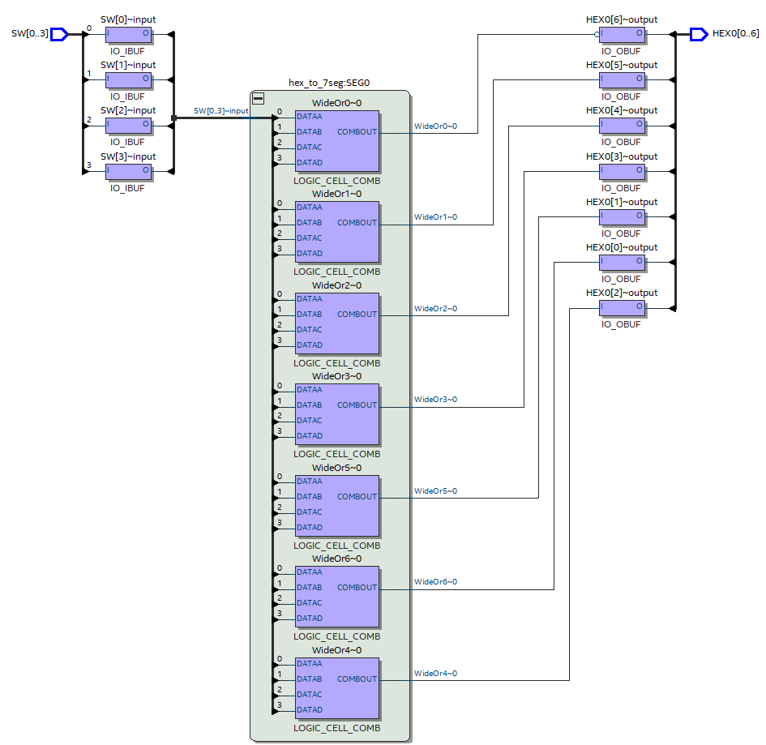

We see we have 4 inputs (`SW[0]`-`SW[3]`) connected to the input pins of the FPGA. We also have 7 outputs (`HEX0[0]`-`HEX0[6]`) connected to the output pins. This matches with the Compilation Report in which it states 11 pins are used.

However, there seems to be only 7 logic elements used as we have 7 `WideOr` blocks. The Flow Summary stated that 8 logic elements were used, so there appears to be a disparity. 

However, looking at the Analysis & Synthesis Summary in the Compilation Report, it states that 7 logic elements are used which is in agreement with what we see.

Looking at the Technology Map Viewer (Post-Fitting), we see this:

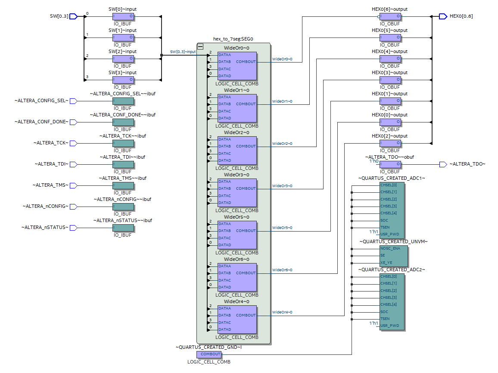

We now see an additional labeled `~QUARTUS_CREATED_GND~I` which is a ground signal that Quartus automatically creates in the design during the fitting process. It is used to connect unused inputs or provide a constant `0` to parts of the design if needed. This accounts for the missing logic element (LE) that we saw in the overall Compilation Report.

### Timing Analyser

The Timing Analyser is a tool used to evaluate the timing performance of the FPGA design.

In `Tools -> Timing Analyser`, I viewed the Report Datasheet for Minimum Propagation Delay at $85\degree\text{C}$ and $0\degree\text{C}$.

This is what I viewed at $85\degree\text{C}$:

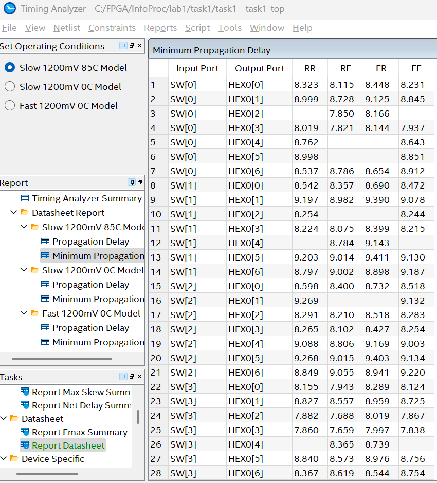

The column `RR` shows the delay measured from rising edge to rising edge, `RF` from rising edge to falling edge, `FR` from falling edge to rising edge, and finally `FF` from falling edge to falling edge.

This is what I viewed at $0\degree\text{C}$:

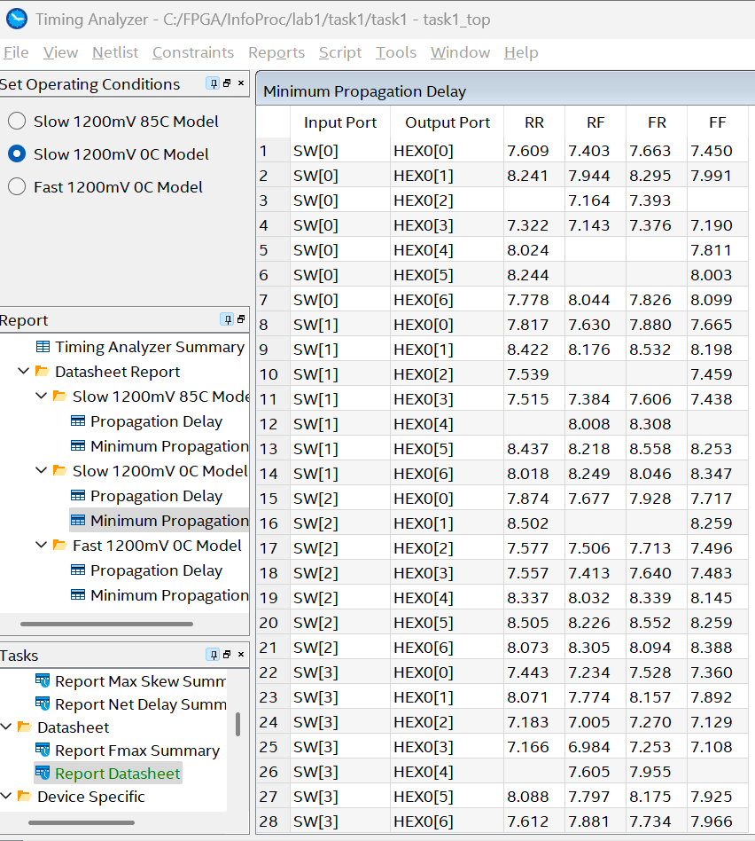

It is quite clear to see that the delay is smaller in all cases at the lower temperature of $0\degree\text{C}$.

## Task 2 - Extending to 10 Switches and 3 7-Segment Displays

We now want to extend our design such that we can use all 10 sliding switches `SW0-SW9` to display numbers up to `1023` which corresponds to `0x3FF` which will display on 3 of the 7-segment displays, `HEX0-HEX2`.

### Creating the Project & Writing the Verilog Specification

First, I setup the project in the directory `lab1/task2` as before, naming the project `task2` and the top-level file `task2_top`. I also did the device assignment as in task 1.

I then copied the `hex_to_7seg.v` and `pin_assignment` files into my directory. I then created a new top-level Verilog specification `task2_top.v` and wrote the following code:

```verilog
module task2_top (
	input  [9:0] SW,		// 10-bit input switches
	output [6:0] HEX0,	
	output [6:0] HEX1,	// hex output on 7-segment displays
	output [6:0] HEX2
);

hex_to_7seg SEG0 (		// instantiate hex_to_7seg for HEX0
	.in(SW[3:0]),
	.out(HEX0)
);

hex_to_7seg SEG1 (		// instantiate hex_to_7seg for HEX1
	.in(SW[7:4]),
	.out(HEX1)
);

hex_to_7seg SEG2 (		// instantiate hex_to_7seg for HEX2
	.in({2'b0, SW[9:8]}),
	.out(HEX2)
);

endmodule

```

This code is very similar to that in task 1, except this time we are using 10 switches (hence why the input `SW` is now 10 bits). Each 7-segment output display is still 7 bits but now we are using 3 separate output displays: `HEX0`, `HEX1` and `HEX2`. We therefore instantiate 3 separate instances of `hex_to_7seg` for `HEX0`, `HEX1` and `HEX2` named `SEG0`, `SEG1` and `SEG2` respectively.

Clearly the input for `SEG0` and `SEG1` is `SW[3:0]` and `SW[7:4]` respectively as the least significant 4 bits of the input correspond to the least significant hex digit, that is, the digit on `HEX0`; `SW[7:4]` are the next 4 bits that correspond to the hex digit displayed on `HEX1`.

But the remaining 2 switches, `SW8` and `SW9` give us a 2 bit number, however in our `hex_to_7seg.v`, we expect a 4-bit input. We therefore concatenate two `0`-bits onto `SW[9:8]` so that that our input becomes `{2'b0, SW[9], SW[8]}`. We therefore expect that the maximum possible value on this most significant 7-segment display will be `3`.

I then saved this file, set it as the top-level entity and added both files in the project.

Finally, I inserted the `pin_assignment.txt` file into the `task2_top.qsf` file to quickly and easily assign all pins.

### Compilation & Programming the FPGA

I then started Analysis & Elaboration to ensure there were no errors in my design, and then compiled it.

In this design, there were 18 total logic elements and 31 pins used: 


I then blasted the FPGA with the `task2_top.sof` file. As expected, I could change the switches to display hexadecimal digits on three of the 7-segment displays.
The maximum value was `0x3FF` when all switches were in the up position.

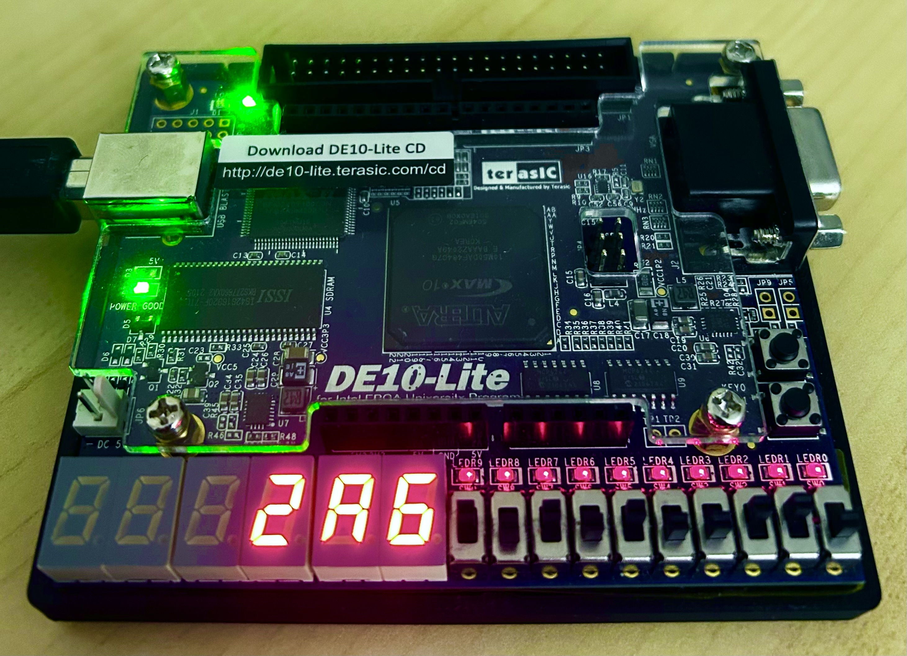
