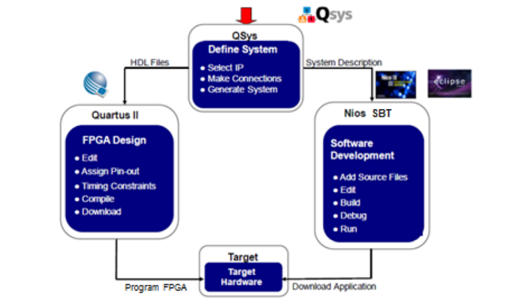
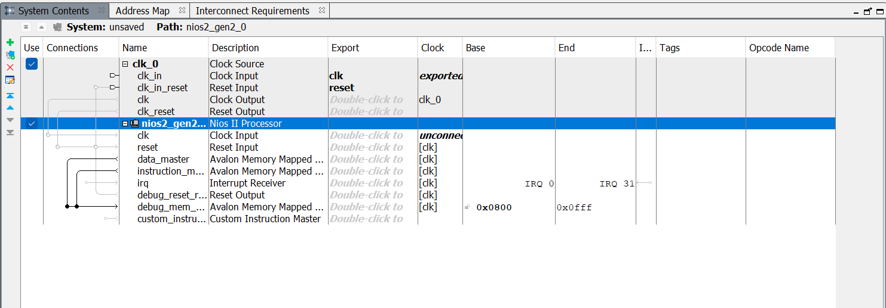
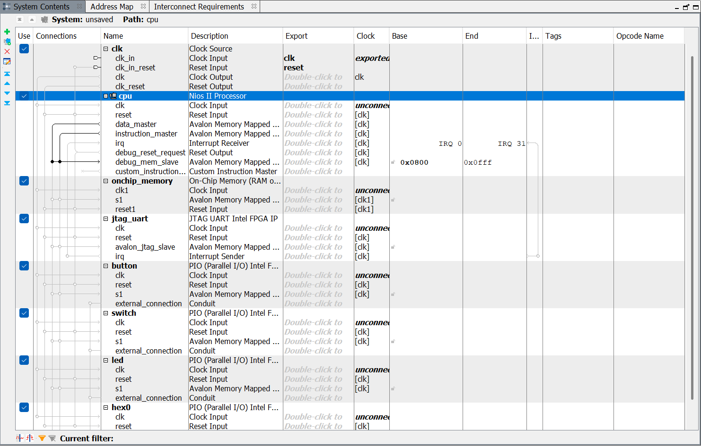
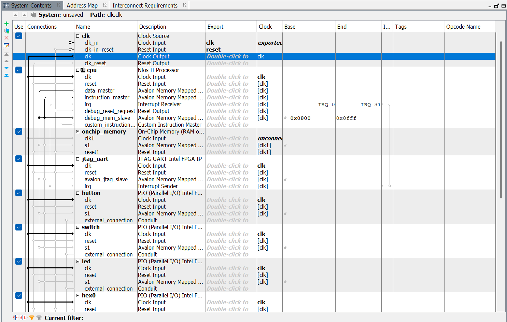
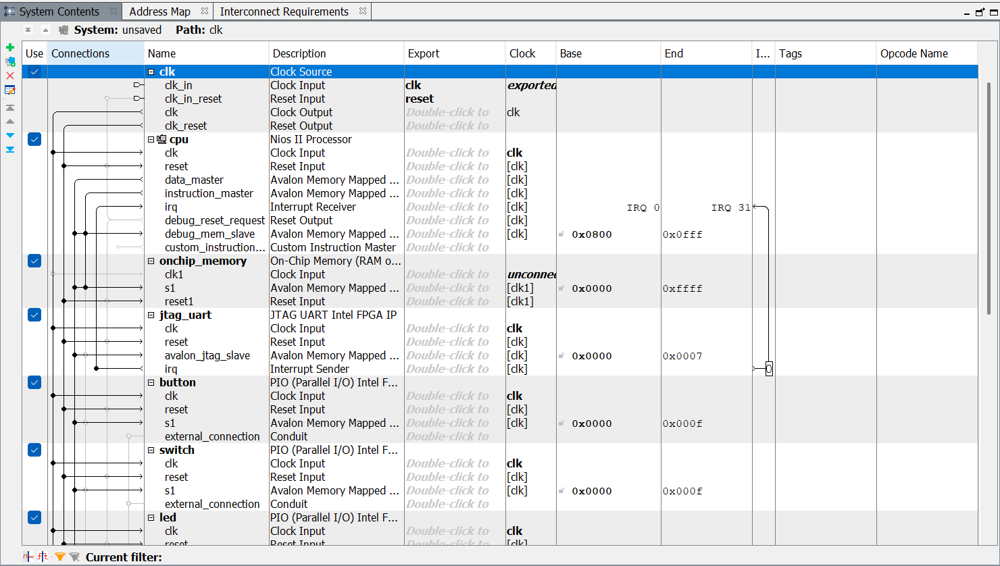
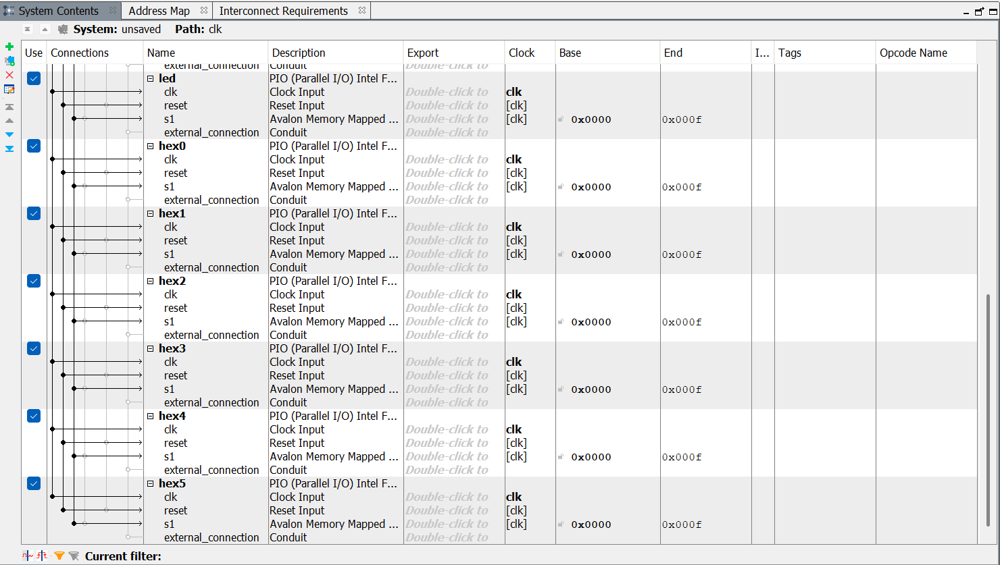
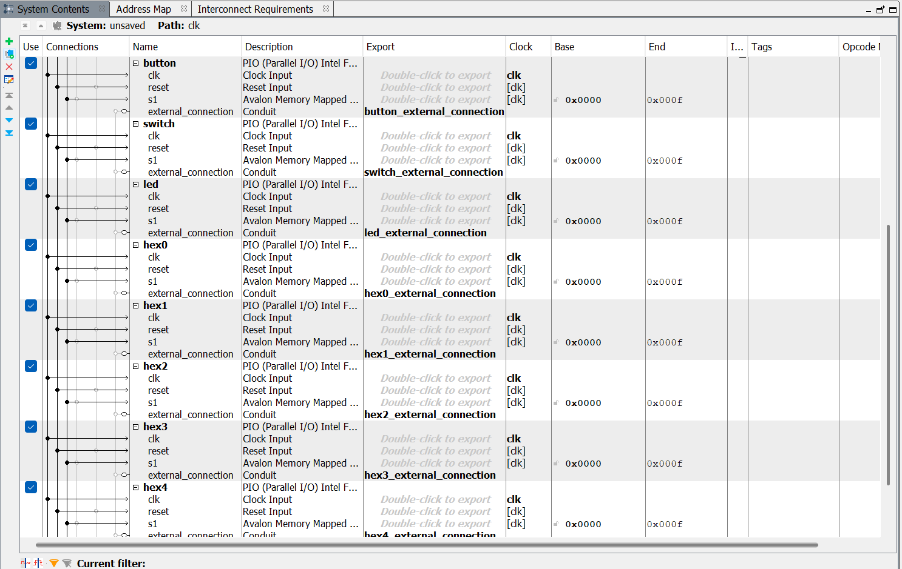
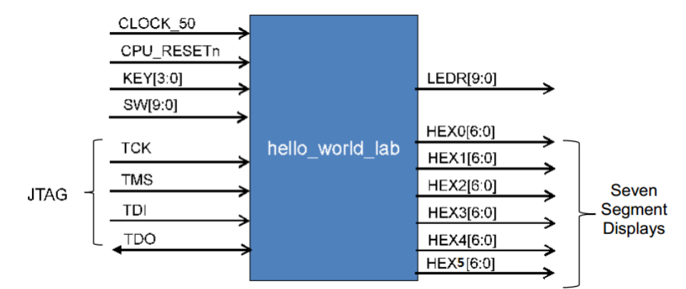
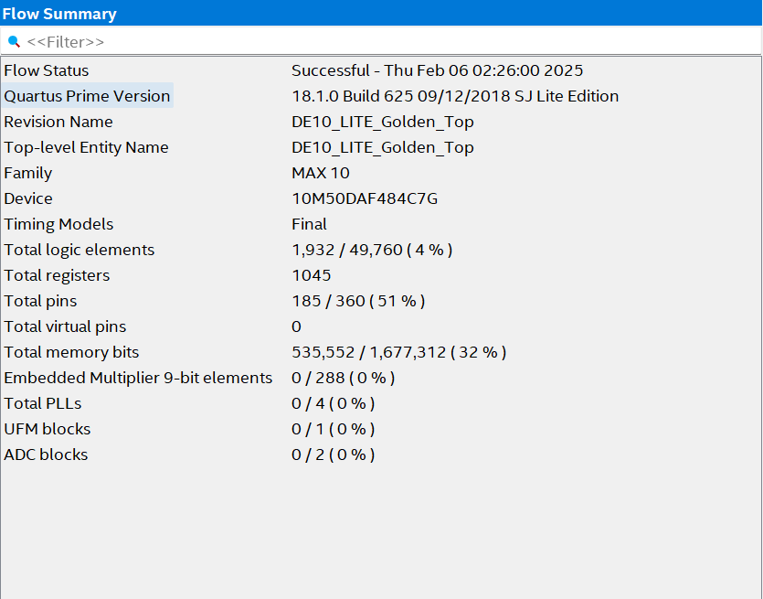
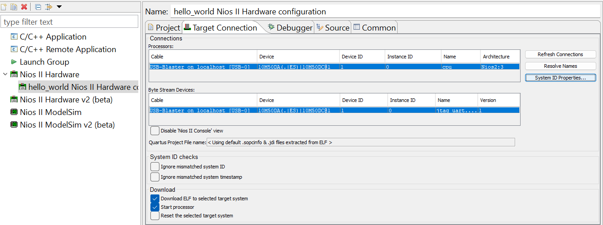

# Lab 2 - Designing & Programming a Nios II System

## Task 1 - Design a Nios II System

In this lab, we instantiate the Nios II soft-core processor on the FPGA, connect it to various peripherals of the board (UART, SPI etc.) and establish a communication with the host PC to display a "hello" message on the terminal.

Unlike a hard-core processor (which is physically embedded in silicon), a soft-core processor is implemented using the programmable logic fabric of an FPGA. Essentially, instantiating the Nios II processor gives the FPGA the *functionality* of of a processor. Once instantiated, the processor can then be programmed just like a microprocessor to run software on it.

We use Qsys (now called Platform Designer) to modify the processor system hardware.

This is the general Qsys development flow, and it illustrates how an overall system is integrated using the combination of the Qsys system integration tool, Quartus for mapping (synthesis), fitting (place and route) and the NIOS Software Built Tool (SBT) for software development:




### Building the Qsys Based Processor System

First, I launched Platform Designer (formerly Qsys) from Quartus via `Tools -> Platform Designer`. Within Qsys in the System Contents panel, there is a diagram that illustrates what we are designing in the Qsys environment.

The system we build will have a clock (inserted by default), a single master (the Nios II processor) and 11 slave devices.

The terms master and slave refer to how devices interact and control the flow of data in the system.

The master device is the component that **controls** the communication as well as how and when data is transferred. The Nios II processor is the master as it initiates commands, requests and operations within the system. The master can also access slaves (these could be memory, peripherals etc.).

A slave device responds to requests or commands initiated by the master. Slaves cannot initiate communication but only respond to instructions from the master. In a system like this with the Nios II processor as the master, the slave devices could include components like memory, peripherals or I/O devices.

#### Adding in the Nios II Processor

Next I added in the Nios II Processor from the IP Catalog. We then see the `nios2_gen2_0` processor in the connection diagram:



We can make connections very easily by clicking on the nodes on the 'wires' in the connections panel. This can be done as we add each individual component but it's often easier to make all the connections once all the blocks have been added.

#### Adding the On-Chip Memory

Now we have added the Nios II processor, we also need to add the **On-Chip Memory** as well as the <u>**peripherals**</u> including the **JTAG UART**, **pushbutton inputs**, **switch inputs**, **led outputs** and the **7-segment display output** to the system.

The On-Chip Memory is memory that is physically located on the FPGA itself which is directly accessible to the Nios II processor and any other components within the FPGA system. It is usually used for fast access storage to store program code (i.e. instructions), data, and variables.

The JTAG UART is a communication interface which allows communication between the FPGA and host PC through the JTAG port. It is used for serial data transmission (i.e. 1 bit at a time over a single communication line) and it is asynchronous (data transfer without a clock signal).

We search for the On-Chip Memory in the IP Catalog in the same way as we searched for the Nios II Processor. We configure the memory size to 65,536 bytes to ensure that there is plenty of space for the software program.

We now have three components in the Qsys system: `clk_0`, `nios2_gen2_0` and `onchip_memory2_0`.

#### Adding the JTAG UART 

We now add the JTAG UART, finding it from the IP Catalog as before. We keep the default settings for this component.

#### Adding Parallel I/O (PIO) for Modeling Switches, Pushbuttons, LEDs & 7-Segment Display

These five components which handle the interfacing of the switches, pushbuttons and LEDs are configured instances of general purpose parallel I/O components. By using PIO blocks for the switches, buttons and LEDs, we can map the block to the address space (a range of addresses that the processor can access, i.e. read from or write to) and the C code will read and write these components.

In the IP Catalog, we search for the parallel I/O block. For the pushbutton block, we set the PIO block up as a 4-bit input interface as there are two pushbuttons on the board that we would like to read from, and two internal signals (a modification to HDL to suuport the DE10 board).

For the switch block, we set the PIO block up as a 10-bit input interface, since there are 10 switches on the board.

For the LEDs, we configure the component to be a 10-bit output interface since there are 10 LEDs on the board.

Finally, we add the six 7-segment displays allowing us to display text on the board. We add another PIO component, configuring it as a 7-bit (because 7-segment) output.

We now have eight components in our Qsys system: `clk_0`, `nios2_gen2_0`, `onchip_memory2_0`, `jtag_uart_0`, `pio_0`, `pio_1`, `pio_2` and `pio_3`.

To make these components' names easier to remember and reference, we rename them to `clk`, `cpu`, `onchip_memory`, `jtag_uart`, `button`, `switch`, `led` and `hex0` respectively:



Since there are six 7-segment displays, I duplicated the `hex0` PIO block, calling them `hex0`, `hex1`, `hex2`, `hex3`, `hex4` and `hex5`.

#### Connecting the Qsys System Components Together

Now we need to make the appropriate connections between the components.

We make connections by clicking on the signal we want (in this case the `clk` output signal coming out of the `clk` component) and clicking on the small open circles on the lines that intersect with the other components; that is, we make connections with the `clk` inputs of each of the other components as seen below:



We do the same for the `clk_reset` output signal from the `clk` component the the `reset` input signals on the other components.

We then connect the `cpu.data_master` to the slaves. We make connections between the `cpu.data_master` and the `avalon_jtag_slave` on the `uart` component, and between the `cpu.data_master` and the `s1` ports on the other components. 

We also connected `cpu.instruction_master` to the `s1` port of `onchip_memory`. The `instruction_master` signal from the `cpu` does not need to be connected to each slave component as it only needs access to memory that contains the software executable.

Finally, we connect the processor interrupt request (IRQ) signals. We make the connection from `irq`sender on the `uart` block to the `irq` receiver on the `cpu`. The UART can drive interrupts and hence needs to be wired to the cpu processor interrupt lines.

We have now completed the internal connections for the Nios II processor based system:




We now need to make the external connections that connect the Qsys based system to the next hierarchy of the FPGA design, or to FPGA device pins that connect to the board.

To do this, we double click on the `button`, `switch`, `led` and `hex0`-`hex5` conduit items under the export column. The export column lets us expose signals from the IP components to the top-lvel entity of the design. In other words, when we double click a conduit item under the export column, we are exporting that signal to the top-level Verilog file, which allows us to directly connect the external hardware (buttons, switches etc.) to the FPGA pins.

The names of the exports are shown below:



Before we proceed, we add a System ID Peripheral FPGA IP Unit from the IP Catalog and attach the `clk` and `reset` signals as expected, as well as the `cpu.data_master` to the `control_slave` on the `sysid_qsys_0` block. This is just used to store a unique identifier and timestamp to verify that the correct software is running on the correct hardware version.

Next, we need to generate base addresses for the Qsys system. Each component that communicates over the Avalon Memory-Mapped bus (this is the interconnect enabling the master to read from/write to different peripherals (slaves)) needs a unique base address. This is the starting memory address assigned to a component within the memory map of the system, which defines where the master can access that component.

We can assign base addresses via `System -> Assign Base Addresses`.

I then saved the Qsys system and called it `nios_setup_v2.qsys`.

There are couple of errors shown that indicate that the reset and exception slave is not specified for the processor. This is because the Nios II processor does not know where the software code that handles resets and exceptions is located. By setting the reset vector memory and exception vector memory to `onchip_memory.s1`, this resolves that issue. This sets the system to execute from onchip memory at these respective locations upon reset or interrupt.

Finally, we can now generate the HDL files to implement the system we have designed in Qsys.

### Building the Top-Level Design

Now, we need to bind together the Qsys system with Verilog code. In the design we specified, there is a clock, reset, pushbutton inputs, LED outputs, six 7-segment display outputs and a JTAG UART.

 The JTAG UART pins are hard-wired into the FPGA so they don't need to be added in the Verilog source file. Only pins synthesised from the RTL source code need to be specified.

 This is the block diagram of our design:

 

 We are provided with a top-level module `DE10_LITE_Golden_Top.v` which contains the necessary code to connect our design to the physical components of the board. We also need to instantiate the Qsys system into this top-level Verilog code. We can do this by copying the Nios II instantiation from the `nios_setup_v2_inst.v` file (this was auto-generated from `nios_setup_v2.qsys` earlier) into `DE10_LITE_Golden_Top.v`.

This is the Nios II instantiation in `nios_setup_v2_inst.v`:
 ```verilog
nios_setup_v2 u0 (
    .clk_clk                           (<connected-to-clk_clk>),                           //                        clk.clk
    .reset_reset_n                     (<connected-to-reset_reset_n>),                     //                      reset.reset_n
    .button_external_connection_export (<connected-to-button_external_connection_export>), // button_external_connection.export
    .switch_external_connection_export (<connected-to-switch_external_connection_export>), // switch_external_connection.export
    .led_external_connection_export    (<connected-to-led_external_connection_export>),    //    led_external_connection.export
    .hex0_external_connection_export   (<connected-to-hex0_external_connection_export>),   //   hex0_external_connection.export
    .hex1_external_connection_export   (<connected-to-hex1_external_connection_export>),   //   hex1_external_connection.export
    .hex2_external_connection_export   (<connected-to-hex2_external_connection_export>),   //   hex2_external_connection.export
    .hex3_external_connection_export   (<connected-to-hex3_external_connection_export>),   //   hex3_external_connection.export
    .hex4_external_connection_export   (<connected-to-hex4_external_connection_export>),   //   hex4_external_connection.export
    .hex5_external_connection_export   (<connected-to-hex5_external_connection_export>)    //   hex5_external_connection.export
);
 ```

 We copy this to `DE10_LITE_Golden_Top.v`, editing the placeholder names such as `<connected-to-clk_clk>` with actual signals that correspond to real pins or signals on the DE10 board:
 
 ```verilog
nios_setup_v2 system (
	.clk_clk(MAX10_CLK1_50),                        // clk.clk
	.reset_reset_n(1'b1),									// reset.reset_n
	.button_external_connection_export(KEY[1:0]),	// button_external_connection.export
	.switch_external_connection_export(SW[9:0]),		// switch_external_connection.export
	.led_external_connection_export(LEDR[9:0]),		// led_external_connection.export
	.hex0_external_connection_export(HEX0),			// hex0_external_connection.export
	.hex1_external_connection_export(HEX1),			// hex1_external_connection.export
	.hex2_external_connection_export(HEX2),			// hex2_external_connection.export
	.hex3_external_connection_export(HEX3),			// hex3_external_connection.export
	.hex4_external_connection_export(HEX4),			// hex4_external_connection.export
	.hex5_external_connection_export(HEX5)				// hex5_external_connection.export
);
 ```

The clock input for the Nios II processor is connected to the board's clock source, that is, `MAX10_CLK1_50` which refers to a 50MHz clock on the DE10-Lite board.

The reset is connected to a constant high value, `1'b1`.

The buttons are connected to `KEY[1:0]` which correspond to the physical pushbuttons on the board. The switches are connected to `SW[9:0]` as seen before; the LEDs to `LEDR[9:0]` and the 7-seg displays to `HEX0`-`HEX5`.

Also note that the module name, `nios_setup_v2` should be the same as the system name, which it is. `system` is simply the instance name.

Now, we add the `nios_setup_v2.qsys` and the `DE10_LITE_Golden_Top.v` files to the project in Quartus. The `.qsys` file contains the information for the Nios II Qsys system that we previously created and the `.v` file connects the Qsys system we made to the inputs and output of our board. The pin assignment has already been done for us and so now we can compile our design. 

The compilation will run Analysis & Synthesis, Fitter (place and route), Assembler (generate programming image) and the Timing Analyser.

This was the compilation report summary:



And now the FPGA hardware design is complete. We now want to create software to program our Nios II system that will run on the board.


## Task 2 - Program a Nios II System

### Creating the Software for a "Hello World" Design

As part of Quartus, the Nios II Software Build Tools for Eclipse are included. These tools help manage creation of the application software and Board Support Package (BSP).

We first launch the SBT tool from the `Tools` menu in Quartus. The Eclipse SBT will launch and in the project explorer, we create a new 'Nios II Application and BSP from Template'. The BSP is the Board Support Package which contains drivers for translating things like `printf` C commands to the appropriate instructions to write to the terminal.

This creates for us a Nios II Software template for a simple "Hello World" application. We have to also specify the location of the `.sopcinfo` file which we generated in the compilation, and this file informs Eclipe on what our Qsys system contains.

Two separate folders are generated: `hello_world_sw`, which contains the actual application code for the Nios II processor (i.e. C or C++ code) and the other folder is `hello_world_sw_bsp` which is the Board Support Package folder containing files that provide the low-level software needed to interact with the hardware. The BSP essentially contains a set of drivers and initialisation code that makes the hardware work with the Nios II processor.

In the `hello_world_sw` folder, we a provided with some very simple C code:

```c
/* "Small Hello World" example. */

#include "sys/alt_stdio.h"

int main()
{ 
  alt_putstr("Hello from Nios II!\n");

  /* Event loop never exits. */
  while (1);

  return 0;
}
```

The `alt_putstr` command writes text to the terminal. This is a command part of the ALtera HAL (Hardware Abstraction Layer) set of software functions. This command is used instead of a standard C `printf` function as the code space is more compact using the HAL commands.

We now want to make some modifications to the code to display the results of the pushbuttons on the LEDs. We therefore add to the code as follows:

```c
#include <sys/alt_stdio.h>
#include <stdio.h>
#include "altera_avalon_pio_regs.h"
#include "system.h"

int main()
{
	int switch_datain;
	alt_putstr("Hello from Nios II!\n");
	alt_putstr("When you press Push Button 0,1 the switching on of the LEDs is done by software\n");
	alt_putstr("But, Switching on/off of LED 2 by SW 2 is done by hardware\n");
	/* Event loop never exits. Read the PB, display on the LED */

	while (1)
	{
		//Gets the data from the pb, recall that a 0 means the button is pressed
		switch_datain = ~IORD_ALTERA_AVALON_PIO_DATA(BUTTON_BASE);
		//Mask the bits so the leftmost LEDs are off (we only care about LED3-0)
		switch_datain &= (0b0000000011);
		//Send the data to the LED
		IOWR_ALTERA_AVALON_PIO_DATA(LED_BASE,switch_datain);

	}
	return 0;
}
```

The `altera_avalon_pio_regs.h` header provides access to the PIO registers. This is used for handling the pushbuttons and LEDs on the board.

The `system.h` header contains the base addresses for the peripherals, allowing the program to interface with these hardware components by defining where their control registers are located in memory.

A new integer variable, `switch_datain` is defined which stores the data read from the push buttons. The `IORD_ALTERA_AVALON_PIO_DATA` function reads (hence IO**RD**) the data from the pushbuttons and inverts the value (`~`) because the button is active when pressed (`0` means the button is pressed). Inverting this ensures that `1` indicates a button being pressed.

`switch_datain &= (0b0000000011);` masks out the unnecessary bits ensuring only only the states of buttons 0 and 1 are considered.

The `IOWR_ALTERA_AVALON_PIO_DATA(Location)` function writes (hence IO**WR**) the data from a specific location (given in the `system.h` file) and reads it into a variable. Calling the function with two parameters, as in, `IOWR_ALTERA_AVALON_PIO_DATA(Location, Value)` writes the numeric value to the given location. We use this function to read the data from the switches and write this value to the LEDs.

The variables `BUTTON_BASE` and `LED_BASE` are created by importing the information from the `.sopcinfo` file.

Now that we have written out code, we can build our project. This compiles the software application and the BSP (drivers). Once this is complete, we observe an `.elf` file under the project. This is the file that needs to be downloaded to Nios and executed.

I then right clicked `hello_world_sw` and selected `Run As -> Run Configurations`. I then navigated to the Target Connections tab. The connection indicates that Eclipse has connected to the USB-Blaster:


After hitting Run, I see this on the console:


Now we blast the FPGA with the `.sof` file that was created during the compilation process.

We can do this using the Nios II Command Shell:

```
/cygdrive/c/FPGA/InfoProc/lab2/tasks
```

We can blast the FPGA with the `.sof` file using this command:
```
$ nios2-configure-sof DE10_LITE_Golden_Top.sof
```

We then want to download our `.elf` file to the Nios II processor.

I then navigated to where my `.elf` file was:
```
$ cd software/hello_world_sw
```

And then downloaded and ran the software on Nios II:
```
$ nios2-download -g hello_world_sw.elf
```

I also opened the Nios II terminal to see any output:
```
$ nios2-terminal
```

I could then see the output of the program on the terminal.

Our C code has now successfully run on the NIOS processor and when I pressed buttons KEY0 and KEY1, LED0 and LED1 were lit up as the processor reads the status of the buttons, writing this to the respective LEDs.
