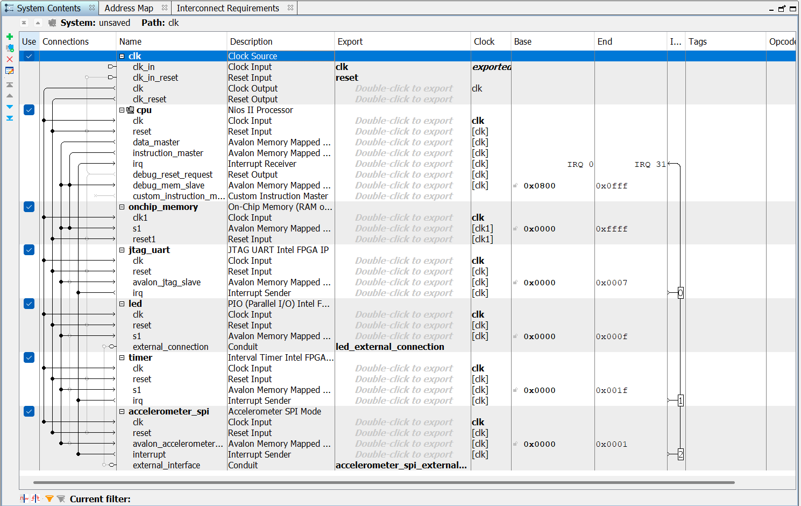

# Lab 2 - Integrating an Accelerometer with Nios II 
## Task 1 - Interface an Accelerometer to a Nios II System

In this lab, we interface the Nios processor with an accelerometer.

The DE10-lite comes with a digital accelerometer sensor module (ADXL345), commonly known as G-sensor. This G-sensor is a small, thin, ultralow power assumption 3-axis accelerometer with high-resolution measurement.

Digitalised output is formatted as 16-bit in two’s complement and can be accessed through SPI (3- and 4-wire) and I²C digital interfaces.

### Designing the Nios II System

The Nios II system we build is similar to the system in lab2, except we now add an additional IP, the Accelerometer SPI mode, which interface the Nios II to an SPI peripheral.

We open the `DE_10_Golden_Top` project provided, launch Qsys and add these IPs:

- Nios II Processor (Nios II/e)
- On Chip Memory (with size 65,536)
- JTAG UART
- PIO for LED (10 bits, output)
- Interval Timer
- Accelerometer SPI Mode

I then renamed the IPs, made the relevant connections and made `led` and `accelerometer_spi` export external connections:



I then assigned the base addresses, set both the reset vector memory and exception vector memory of `cpu` to `onchip_memory.s1`

Finally I saved the file as `nios_accelerometer.qsys` and generated the HDL.

I then returned to Quartus, added the generated `.qsys` file into your project and copied the code from `nios_accelerometer_inst.v` and paste it in my top-level `DE10_LITE_Golden_Top.v` file, editing it to change the placeholder names to actual signals: 

```verilog
nios_accelerometer u0 (
	.clk_clk																(MAX10_CLK1_50),
	.reset_reset_n														(1'b1),
	.led_external_connection_export								(LEDR[9:0]),
	.accelerometer_spi_external_interface_I2C_SDAT			(GSENSOR_SDI),
	.accelerometer_spi_external_interface_I2C_SCLK			(GSENSOR_SCLK),
	.accelerometer_spi_external_interface_G_SENSOR_CS_N	(GSENSOR_CS_N),
	.accelerometer_spi_external_interface_G_SENSOR_INT		(GSENSOR_INT[1])
);
```

The `GSENSOR_SDI` (Serial Data In) signal is the Master Out, Slave In (MOSI) line of the SPI interface. This is how data is transmitted from the Nios II processor to the ADXL345 accelerometer.

The `GSENSOR_SCLK` signal is the Serial Clock line. The SPI master generates the clock signal to synchronise communication.

The `GSENSOR_CS_N` signal is the Chip Select (CS) line.
It is active-low (_N means active-low), meaning the sensor is selected when the signal is 0. This ensures only the ADXL345 responds to SPI communication.

Finally, `GSENSOR_INT[1]` is an interrupt signal from the ADXL345 to the Nios II processor. It can be used to notify the processor when new acceleration data is available or when specific events occur (e.g. motion detection).

Next, I compiled my design. Once it successfully compiled, I launched Eclipse and opened a new Nios II Application and BSP from Template, as in lab2. I then chose the `.sopcinfo` file and chose the "Hello World Small" as the template.

I replaced the template code given with the provided code give in lab3 in `led_accelerometer_main.c`:

```c
#include "system.h"
#include "altera_up_avalon_accelerometer_spi.h"
#include "altera_avalon_timer_regs.h"
#include "altera_avalon_timer.h"
#include "altera_avalon_pio_regs.h"
#include "sys/alt_irq.h"
#include <stdlib.h>

#define OFFSET -32
#define PWM_PERIOD 16

alt_8 pwm = 0;
alt_u8 led;
int level;

void led_write(alt_u8 led_pattern) {
    IOWR(LED_BASE, 0, led_pattern);
}

void convert_read(alt_32 acc_read, int * level, alt_u8 * led) {
    acc_read += OFFSET;
    alt_u8 val = (acc_read >> 6) & 0x07;
    * led = (8 >> val) | (8 << (8 - val));
    * level = (acc_read >> 1) & 0x1f;
}

void sys_timer_isr() {
    IOWR_ALTERA_AVALON_TIMER_STATUS(TIMER_BASE, 0);

    if (pwm < abs(level)) {

        if (level < 0) {
            led_write(led << 1);
        } else {
            led_write(led >> 1);
        }

    } else {
        led_write(led);
    }

    if (pwm > PWM_PERIOD) {
        pwm = 0;
    } else {
        pwm++;
    }

}

void timer_init(void * isr) {

    IOWR_ALTERA_AVALON_TIMER_CONTROL(TIMER_BASE, 0x0003);
    IOWR_ALTERA_AVALON_TIMER_STATUS(TIMER_BASE, 0);
    IOWR_ALTERA_AVALON_TIMER_PERIODL(TIMER_BASE, 0x0900);
    IOWR_ALTERA_AVALON_TIMER_PERIODH(TIMER_BASE, 0x0000);
    alt_irq_register(TIMER_IRQ, 0, isr);
    IOWR_ALTERA_AVALON_TIMER_CONTROL(TIMER_BASE, 0x0007);

}

int main() {

    alt_32 x_read;
    alt_up_accelerometer_spi_dev * acc_dev;
    acc_dev = alt_up_accelerometer_spi_open_dev("/dev/accelerometer_spi");
    if (acc_dev == NULL) { // if return 1, check if the spi ip name is "accelerometer_spi"
        return 1;
    }

    timer_init(sys_timer_isr);
    while (1) {

        alt_up_accelerometer_spi_read_x_axis(acc_dev, & x_read);
        // alt_printf("raw data: %x\n", x_read);
        convert_read(x_read, & level, & led);

    }

    return 0;
}
```

I then built the project in Eclipse.

I then opened a Nios II Command Shell and navigated to the directory containing the `.sof` folder:
```
/cygdrive/c/FPGA/InfoProc/lab3/tasks
```

I then blasted the FPGA with the using this command:
```
$ nios2-configure-sof DE10_LITE_Golden_Top.sof
```

At this point, all segments of every 7-segment display turned on (so I saw `8` on all 6 displays).

I then navigated to where my `.elf` file was:
```
$ cd software/led_accelerometer
```

And then downloaded and ran the software on Nios II:
```
$ nios2-download -g led_accelerometer.elf
```

I also opened the Nios II terminal to see any output:
```
$ nios2-terminal
nios2-terminal: connected to hardware target using JTAG UART on cable
nios2-terminal: "USB-Blaster [USB-0]", device 1, instance 0
nios2-terminal: (Use the IDE stop button or Ctrl-C to terminate)
```

Now, when I moved the tilted the board around, the LEDs indicated the tilting position like a spirit level.

https://github.com/user-attachments/assets/335ab0bd-08be-4b5d-a9bd-513c6a73bb38

## Task 2 - Understanding the C Code

```c
#include "system.h"
#include "altera_up_avalon_accelerometer_spi.h"
#include "altera_avalon_timer_regs.h"
#include "altera_avalon_timer.h"
#include "altera_avalon_pio_regs.h"
#include "sys/alt_irq.h"
#include <stdlib.h>

#define OFFSET -32
#define PWM_PERIOD 16

alt_8 pwm = 0;
alt_u8 led;
int level;

void led_write(alt_u8 led_pattern) {
    IOWR(LED_BASE, 0, led_pattern);
}

void convert_read(alt_32 acc_read, int * level, alt_u8 * led) {
    acc_read += OFFSET;
    alt_u8 val = (acc_read >> 6) & 0x07;
    * led = (8 >> val) | (8 << (8 - val));
    * level = (acc_read >> 1) & 0x1f;
}

void sys_timer_isr() {
    IOWR_ALTERA_AVALON_TIMER_STATUS(TIMER_BASE, 0);

    if (pwm < abs(level)) {

        if (level < 0) {
            led_write(led << 1);
        } else {
            led_write(led >> 1);
        }

    } else {
        led_write(led);
    }

    if (pwm > PWM_PERIOD) {
        pwm = 0;
    } else {
        pwm++;
    }

}

void timer_init(void * isr) {

    IOWR_ALTERA_AVALON_TIMER_CONTROL(TIMER_BASE, 0x0003);
    IOWR_ALTERA_AVALON_TIMER_STATUS(TIMER_BASE, 0);
    IOWR_ALTERA_AVALON_TIMER_PERIODL(TIMER_BASE, 0x0900);
    IOWR_ALTERA_AVALON_TIMER_PERIODH(TIMER_BASE, 0x0000);
    alt_irq_register(TIMER_IRQ, 0, isr);
    IOWR_ALTERA_AVALON_TIMER_CONTROL(TIMER_BASE, 0x0007);

}

int main() {

    alt_32 x_read;
    alt_up_accelerometer_spi_dev * acc_dev;
    acc_dev = alt_up_accelerometer_spi_open_dev("/dev/accelerometer_spi");
    if (acc_dev == NULL) { // if return 1, check if the spi ip name is "accelerometer_spi"
        return 1;
    }

    timer_init(sys_timer_isr);
    while (1) {

        alt_up_accelerometer_spi_read_x_axis(acc_dev, & x_read);
        // alt_printf("raw data: %x\n", x_read);
        convert_read(x_read, & level, & led);

    }

    return 0;
}
```

Starting from the `main()`, we initialise the accelerometer device:
`alt_up_accelerometer_spi_open_dev("/dev/accelerometer_spi")`. We also initialise the timer for handling periodic LED updates `timer_init(sys_timer_isr)`.

The `x` axis accelerometer value is then read: `alt_up_accelerometer_spi_read_x_axis(acc_dev, &x_read)`.

And then the `convert_read()` function converts the raw accelerometer `x` value to a LED pattern and tilt level.

In this line: `acc_read += OFFSET;`, the `x` axis accelerometer value is represented by 9 bits in 2s complement form, where the sign bit representes the direction of the acceleration.

The line `alt_u8 val = (acc_read >> 6) & 0x07;` then shifts these 9 bits right by 6 bits (so top 3 bits are now bottom 3 bits) and then masks out all the bits except these bottom three bits.

The following line, `* led = (8 >> val) | (8 << (8 - val));`, manipulates the LED pattern based on `val` (the 3 MSBs of the original accelerometer x axis value).

`* led = (8 >> val)` shifts `8` which is `0b00001000` in binary by `val` positions to the right. For example, if `val = 3`, result is `0b00000001`.

`(8 << (8 - val));` shifts `8` by `8 - val` positions to the left. So if `val = 3` again, the result is `0b01000000`. The `|` is the bitwise OR which combines the two results, so in the case of `val = 3`, the overall result is `0b01001000`.

Here is a table of every possible value of `val` and the corresponding LED patterns:

| **val** | **(8 >> val) (Binary)** | **(8 << (8 - val)) (Binary)** | **Result (\*led) (Binary)** | **Result (\*led) (Hex)** |
|---------|-------------------------|-------------------------------|---------------------------|------------------------|
| 0       | `00001000`              | `00000000`                    | `00001000`                | `0x08`                 |
| 1       | `00000100`              | `00000000`                    | `00000100`                | `0x04`                 |
| 2       | `00000010`              | `00000000`                    | `00000010`                | `0x02`                 |
| 3       | `00000001`              | `00000000`                    | `00000001`                | `0x01`                 |
| 4       | `00000000`              | `10000000`                    | `10000000`                | `0x80`                 |
| 5       | `00000000`              | `01000000`                    | `01000000`                | `0x40`                 |
| 6       | `00000000`              | `00100000`                    | `00100000`                | `0x20`                 |
| 7       | `00000000`              | `00010000`                    | `00010000`                | `0x10`                 |

`*led = 0x08` corresponds to led 3 lighting up, `*led = 0x40` corresponds to led 5 lighting up etc..

`* level = (acc_read >> 1) & 0x1f;` shifts the value of `acc_read` which has the OFFSET applied by 1 to the right and then extracts the least significant 5 bits. This represents the level of the tilt between `0` and `31`.
