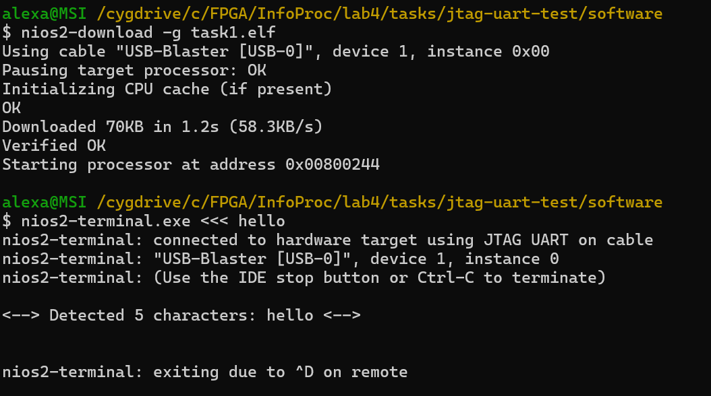
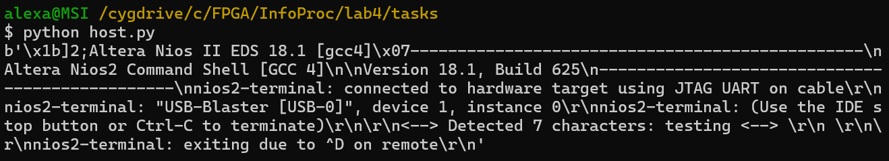

# Lab 4 - Integrate an Accelerometer with a NIOS

## Task 1 - UART Communication with a Host PC

Within lab 4, there is a Phase-Locked Loop (PLL) which is a hardware block used for clock management. It helps in generating stable and high-frequency clock signals and for shifting the phase of clock signals. As in this design, there is off-chip memory, the signals to and from this exhibit considerable delays and so a phase-shifted version of the clock needs to be used to allow the data a full clock cycle for registration.

If we didn't have phase shifting, since data is sampled on the rising edge of the clock and because these is a considerable delay in reading data from memory, the data might not be ready in time when the FPGA expects it.
This could cause setup timing violations, where the FPGA reads incorrect or unstable data.

There are two sides to this communication: the host side (`host.py`) and the board side (`jtag-uart-test/software/task1/task1.c`). 

First, the host (`host.py`) sends data to the board. The function `send_on_jtag(cmd)` in `host.py` begins by running a subprocess to execute the Nios II Command Shell (`C:/intelFPGA_lite/18.1/nios2eds/Nios II Command Shell.bat`). Inside the command shell, it executes the `nios2-terminal` command. It then sends the `cmd` string to the FPGA via JTAG and will read the output from `nios2-terminal` and then terminates the process.

```
python
process = subprocess.Popen(
    NIOS_CMD_SHELL_BAT,
    bufsize=0,
    stdin=subprocess.PIPE,
    stdout=subprocess.PIPE,
)

vals, err = process.communicate(
    bytes("nios2-terminal <<< {}".format(cmd), "utf-8")
)
```

On the board-sde, the FPGA will then receive this data.
The C program (task1.c) running on the FPGA waits for input with this line of code:

```
c
prevLetter = alt_getchar();
```
This `alt_getchar()` function essentially polls the UART port for input.
`alt_getchar()` is also a blocking function, meaning it blocks execution until a character arrives via JTAG.
When a character is received, it enters the `generate_text()` function. Within this function, the character is stored in a buffer:

```
c
text[idx] = newCurr;     // Add the next letter to the text buffer
idx++;                   // Keep track of the number of characters read
newCurr = alt_getchar(); // Get the next character
```

Characters keep accumulating in `text[]` until either a newline (`\n`) is received or the quit letter (`~`) is received (stopping execution).

Once a full message is received, the FPGA sends the processed text back via JTAG to `nios2-terminal`.

Finally, the python code captures the board’s output using:

```
python
vals, err = process.communicate(...)
```
The output from `nios2-terminal` (which contains the FPGAs response) is stored in `vals` and printed.

In the python code, there is an example where the string that is sent is `"testing"`. The FPGA should receive the string, processe it and store it in `text[]`. It should then send back:
```
<--> Detected 7 characters: testing <--> 
```
via JTAG to `nios2-terminal`.

In this design, the NIOS processing is put into a slave mode, responding to the commands sent out by the host.

As in previous labs, ran the programmer to download the `.sof` file to the DE10-Lite Board.

I then used the Nios II Command Shell to navigate to where the `.elf` file was:

```
$ cd /cygdrive/c/FPGA/InfoProc/lab4/tasks/jtag-uart-test/software/
```

And then downloaded and ran the software on Nios II:
```
$ nios2-download -g task1.elf
```

I then ran this command and this was the output:

```
$ nios2-terminal.exe <<< hello
```



I also ran `python host.py` to start the host program. This essentially does the same as the above.



## Task 2 - Extend the Lab 3 System

We now want to integrate this system with the Lab 3 project, which used the accelerometer to control which LEDs were turned on on the board. 

We want to modify the code so the system can operate between two modes depending on the command receieved by the host:

- Mode 0: no filtering of accelerometer data
- Mode 1: filtering the accelerometer data should occur

The best way I thought to do this was to modify `host.py` to send mode selection commands (`0` or `1`) to the Nios II.

Since we are now taking readings from the accelerometer and polling the JTAG, we probably want to reduce the frequency of the polling as this could slow down the accelerometer readings.