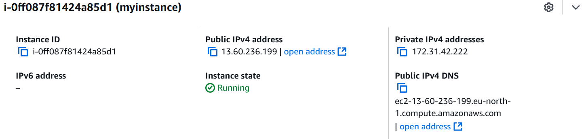
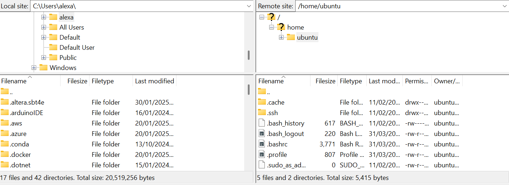
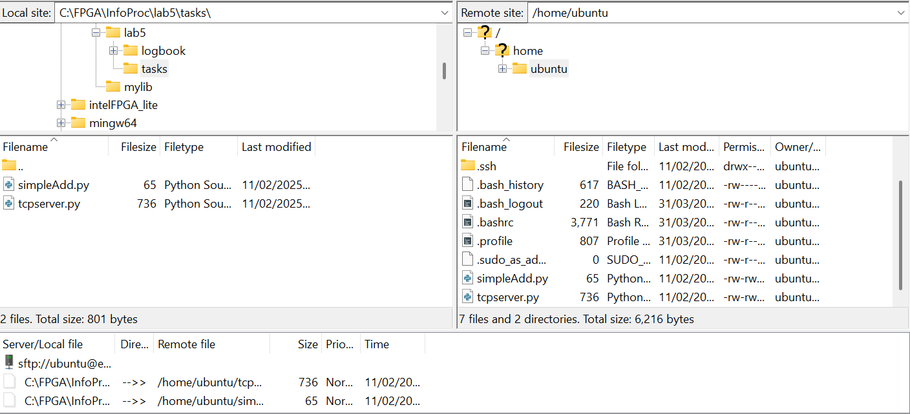

# Lab 5 - AWS, SSH Clients, Client-Server Programming
## Instantiating an EC2 Instance

First, I signed into the AWS console as a root user. There is also the option to create an IAM (Identity and Access Manager) user which is used to create an entity (person or application) that can interact with AWS servies under certain permissions.

I then navigated to the EC2 (Elastic Compute Cloud) service and launched an EC2 instance.

EC2 stands for Elastic Compute Cloud and gives access to scalable, on-demand virtual computers on the cloud. It allows us to run applications without needing to buy and maintain physical hardware. You can launch, configure, and manage virtual machines (called instances) with different operating systems, CPU, memory, and storage options.

This is a summary of a few benefits of hosting a server on the cloud (e.g. EC2):
- Scalability: Easily scale resources as needed.
- Low Latency: Minimize communication delays by hosting in the same region.
- Security: Advanced cloud security features.
- Cost Efficiency: Pay only for what you use, no upfront hardware costs.
- Global Reach: Cloud services with global data centers.
- Automatic Maintenance: Cloud providers handle updates and infrastructure management.

Once the EC2 instance is launched, we have to choose different specifications for this new instance.

First we name the instance. I called it `myinstance`.

We then choose the AMI (Amazon Machine Image). This is a template that contains the software configuration (operating system, type of processor, storage etc.). I chose Ubuntu 24.04 LTS which is a Linux-based operating system. This allows us to use the command line to execute Linux commands remotely.

I then picked the 64-bit x86 processor type and chose the instance type (which are essentially the hardware specs) as `t3.micro`.`t3.micro` has 2 vCPUs (these are virtual processor cores that represent a portion of physical CPU's processing power allocated by AWS to our instance) and it has 1 GiB Memory. These `t3` instances are designed to be suitable for applications requiring occasional spikes of computation.

Next, I had to create a key pair. A key pair in AWS is a combination of a public key and a private key used by an ecryption protocol, such as RSA. When we connect to our server through an SSH client, we need to use this key pair because SSH uses an encryption protocol when connecting to the server. I caled the key pair name `ec1-11-02-2025`, selected the encryption type RSA and downloaded the key pair as a `.pem` file (since I will be using WSL to connect to the instance using SSH via the command line, rather than using PuTTY).

Then I had to choose the network settings. This directly affects the communication between our TCP client and the TCP server on the EC2 instance. Sepcifically, under inbound security groups rules, I set this to **All TCP**. This make the instance less secure as it opens up the instance to all types of TCP traffic on the specified port (port 0 to 65535).
This means it allows any TCP connection, i.e. anyone on the internet can connect to the instance on any open port without restriction, which increases the risk of attacks.

If we later want an instance with SSH as the security group, we can add additional SSH specific code the the python client.

I then configured the storage, picking the default options.

Next, in preparation for the next lab, I created an IAM role, in which we will use DynamoDB which is Amazon's non-relational database. I selected EC2 as use case and searched for DybamoDB on the permissions policies. This allows our EC2 instance to communicate with DynamoDB using this role.

Now the instance is configured and these are the details:



We see that there is a Public IPv4 address and a Private IPv4 address. There are some important distintions between the two.

A public IP address is an IP address that is accessible from the internet. It's used to uniquely identify devices that need to be reachable from outside a private network. They allows communication between devices on the internet (e.g., when you access websites, you use public IP addresses).
They are assigned by Internet Service Providers (ISPs) or cloud providers (e.g. AWS).
In the context of an EC2 instance, it is assigned a public IP to allow access from the internet.

A private IP address is used within a private network and cannot be accessed directly from the internet. It's used for communication between devices within a local network or cloud infrastructure.
In our case, it allows our EC2 instances to communicate securely and privately.

## Communicating with the EC2 Instance

For this there are several options. One option is to use PuTTY which is a popular SSH client for Windows, which allows remote access to Linux servers (like our EC2 instance) via SSH.

I used WSL instead which allows me to run a full Linux distribution directly on Windows which comes with the inbuilt OpenSSH client which allows us to use `ssh` directly from the terminal.

First I opened a terminal window and launched WSL by running the `wsl` command:

```bash
C:\Users\alexa>wsl
alex@MSI:/mnt/c/Users/alexa$
```
I then ran this command:

```bash
ssh -i ~/.ssh/ec1-11-02-2025.pem ubuntu@ec2-13-60-236-199.eu-north-1.compute.amazonaws.com
```

`ssh` stands for Secure Shell and it is a protocol used to securely connect to remote machines over a network (in this case, the EC2 instance)

`-i ~/.ssh/ec1-11-02-2025.pem` tells ssh to use a specific private key file for authentication and provides the path to the private key file (.pem) that corresponds to the public key set up on the EC2 instance when it was launched.
The private key is used to authenticate your machine to the EC2 instance, allowing you to log in securely without needing a password.

`ec2-13-60-236-199.eu-north-1.compute.amazonaws.com` is the public DNS (Domain Name System) address of your EC2 instance, assigned by AWS.
This address points to the location of your EC2 instance on the internet and is used to reach your server.

Now, we can execute Linux commands on the remote machine. 

Next I installed Python 3.12 on the EC2 instance using `sudo apt install python3.12`. `sudo` is a command that allows us to perform administrative tasks on a Linux system and `apt` is used to install various packages. It can be used to install anything needed on the EC2 instance. 

Now python is installed, we can execute python code on the EC2 instance. However, we now want to be able to write code on our local machine, then move it to EC2 and run it there. We can use FileZilla to transfer files from our local machine to EC2.

I downloaded FileZilla, created a 'New Site' called `ec2`. I then set the protocol as SFTP (SSH File Transfer Protocol), set the host as the public IPv4 DNS of the EC2 instance, set the port to 22 (SSH port), set the Logon Type as Key file, User as `ubuntu` (this is default user on EC2 instance) and then browsed for the `.pem` file and connected.

I could thensee the local site and remote site (EC2 instance) side by side and can now drag and drop files between them.



I then created a simple `simpleAdd.py` file locally and used FileZilla to move this file from my local machine to the EC2 instance.



Back on the command line, I executed the program in the EC2 instance by typing `python3 simpleAdd.py`.

```bash
ubuntu@ip-172-31-42-222:~$ python3 simpleAdd.py
The sum of 5 and 7 is 12
```

## Running a TCP Server on the EC2 Instance

Now we want to set up the simple TCP server and client. We will later want to run the server as a service on the EC2 instance so that even after our SSH session with the EC2 instance terminates, the TCP server keeps running.

I first saved this code for a TCP server in a python file locally called `tcpserver.py`.

```python
import socket
print("We're in tcp server...");

#select a server port
server_port = 12000
#create a welcoming socket
welcome_socket = socket.socket(socket.AF_INET, socket.SOCK_STREAM)
#bind the server to the localhost at port server_port
welcome_socket.bind(('0.0.0.0',server_port))

welcome_socket.listen(1)

#ready message
print('Server running on port ', server_port)

#Now the main server loop
while True:
    connection_socket, caddr = welcome_socket.accept()
    #notice recv and send instead of recvto and sendto
    cmsg = connection_socket.recv(1024)
    cmsg = cmsg.decode()
    if(cmsg.isalnum() == False):
        cmsg = "Not alphanumeric.";
    else:
        cmsg = "Alphanumeric";
    connection_socket.send(cmsg.encode())
```

There is nothing special about server port 12000, the server could listen on any port number outside the reserved space. This is the port number that clients will connect to.

The `bind(0)` function used IP address `0.0.0.0` which means the server listens on every available network interface which is what we want our remote server to do. Previously, when we hosted the server on our local computer, we used the address `127.0.0.1` which is localhost. This is the IP assigned to the local-only interface ("loopback") which can only communicate with the same host. 

The server then starts listening for oncoming connections, receieves up to 1024 bytes of data from the client and decodes it, checking if the resulting string is alphanumeric. It then sends the response back to the client and the loop continues indefinitely.

Using FileZilla, I then moved this to the EC2 instance and executed it on the EC2 instance.

```bash
ubuntu@ip-172-31-42-222:~$ python3 tcpserver.py
We're in tcp server...
Server running on port  12000
```

The server is now running and ready to lsiten to a TCP client. Now we want to run the client on our local machine.

This is the python code for the TCP client:

```python
import socket
print("We're in tcp client...");

#the server name and port client wishes to access
server_name = '13.60.236.199'

#'52.205.252.164'
server_port = 12000
#create a TCP client socket
client_socket = socket.socket(socket.AF_INET, socket.SOCK_STREAM)

#Set up a TCP connection with the server
#connection_socket will be assigned to this client on the server side
client_socket.connect((server_name, server_port))
msg = input("Enter a string to test if it is alphanumeric: ");

#send the message to the TCP server
client_socket.send(msg.encode())

#return values from the server
msg = client_socket.recv(1024)
print(msg.decode())
client_socket.close()
```

Once again, we set the server port to `12000` which the client will connect to. We also set the IP address to `13.60.236.199` which is the current Public IPv4 address of the EC2 instance. 

We the establish the TCP connection to the server using this IP address and port number we have defined, we get user input, send it to the server and receieve the server's response.

I then ran this program locally on my computer:

```bash
PS C:\FPGA\InfoProc> python -u "c:\FPGA\InfoProc\lab5\tasks\tcpclient.py"
We're in tcp client...
Enter a string to test if it is alphanumeric: hello
Alphanumeric
```

Clearly we see that the client is communicating with the server.

However, currently our TCP server will terminate as soon as our SSH session with the EC2 instance terminates.

To keep the server running after the SSH session terminates (i.e. in the background), we need to launch our `tcpserver.py` code as a service (or a daemon, in Linux terminology).

We can do this using `systemmd` a software component within Linux to configure services.

First, I configured `tcpserver.py` as a service by creating a service configuration file. All services are located in `/etc/systemd/system` and I created a file called `tcpserver.service` in this location, using the nano editor: `sudo nano /etc/systemd/system/tcpserver.service`.

The use of sudo is important as we need superuser rights to create the service file in this location.

We then add this to the `.service` file:

```
[Unit]
Description=TCP server service
After=multi-user.target

[Service]
Type=simple
ExecStart=/usr/bin/python3 /home/ubuntu/tcpserver.py

[Install]
WantedBy=multi-user.target
```

The `multi-user.target` specifications indicate when after the system startup, this service will be executed.
The `ExecStart` flag takes in the command we want to run, where the first argument is the python path and the second is the script to be executed.

We then launch the service on the command line:

```bash
~$ sudo systemctl daemon-reload
~$ sudo systemctl enable tcpserver.service
Created symlink /etc/systemd/system/multi-user.target.wants/tcpserver.service → /etc/systemd/system/tcpserver.service.
~$ sudo systemctl start tcpserver.service
```

In these three lines, we have reloaded the services information, enabled our service and started our service. The TCP server now runs in the background as a service.

Running `~$ ps -ef` shows the currently running processes and `tcpserver.py` is indeed there.

```
root        4786       1  0 12:57 ?        00:00:00 /usr/bin/python3 /home/ubuntu/tcpserver.py
```

If we want to kill server process, we can enter `~$ sudo kill -9 4786` where `4786` is the process id of the process, shown in the second colummn above.

If multiple python processes are running, we can run `~$ sudo pkill python` which kills all python processes.

## Computing Average RTT between TCP Client and TCP Server (EC2 Instance)

We now want to compute the average RTT (Round Trip Time) between the local computer (`tcpclient.py`) and the EC2 instance (`tcpserver.py`) while transmitting one integer of data. RTT is the time taken for the integer to travel from the client ato the server and back.

I edited the `tcpclient`:

```python
import socket
import time
print("We're in tcp client...");

#the server name and port client wishes to access
server_name = '13.60.236.199'
server_port = 12000

#create a TCP client socket
client_socket = socket.socket(socket.AF_INET, socket.SOCK_STREAM)
client_socket.settimeout(1)  # Timeout of 1 second for receiving data

#Set up a TCP connection with the server
#connection_socket will be assigned to this client on the server side
client_socket.connect((server_name, server_port))

total_rtt_time = 0
requests_number = 500

print("Begin RTT Calculation...");

for i in range(requests_number):
    # send an integer to TCP server, in this case i is the request/iteration number
    msg = str(i)

    start_time = time.time()

    #send the message to the TCP server
    client_socket.send(msg.encode())

    #return values from the server
    server_response = client_socket.recv(1024)

    end_time = time.time()

    # calculate the rtt, * 1000 to get in milisecs
    rtt = (end_time - start_time) * 1000 
    total_rtt_time += rtt
    #print(f"Total time so far: {total_rtt_time}")

print(f"Average RTT over {requests_number} communications is: {total_rtt_time / requests_number} ms.")

client_socket.close()
```


In the client, we define the total RTT time of all communications, and we define the number of communications (this is the number of requests that get sent to the server and back to the client). We define this as 500 as per the lab instructions.

We then have a `for` loop which iterates 500 times.

I defined the integer to be sent to the server to just be the current communication/request number (also the current iteration of the loop). It has to be wrapped with `str()` because the `encode()` function in `    client_socket.send(msg.encode())` only takes strings, not integers.

Before we send the integer to the server, we save the time to `start_time` using the `.time()` function from the `time` module. We send the message, wait for the respone from the server, then save the end time to `end_time`. The RTT is then `end_time - start_time`. We multiply the result by 1000 to get the result in miliseconds instead of seconds.

At the end of each iteration of the loop, we add the `rtt` of that iteration to the `total_rtt_time`. Finally once the loop terminates, we calculate the average by dividing by 500.


The `tcpserver.py` is essentially the same as before

```python
import socket
print("We're in tcp server...");

#select a server port
server_port = 12000
#create a welcoming socket
welcome_socket = socket.socket(socket.AF_INET, socket.SOCK_STREAM)
#bind the server to the localhost at port server_port
welcome_socket.bind(('0.0.0.0',server_port))

welcome_socket.listen(1)

#ready message
print('Server running on port ', server_port)

#Now the main server loop
while True:
    connection_socket, caddr = welcome_socket.accept()
    #notice recv and send instead of recvto and sendto
    cmsg = connection_socket.recv(1024)
    
    cmsg = cmsg.decode()

    connection_socket.send(cmsg.encode())

    connection_socket.close()
```

We have to close the socket after sending the response to ensure that the client knows that the server has finished processing that request. Initially I did not have `connection_socket.close()` in the server code and this resulted in only the first loop of the for loop in the client being executed, and afterwards the client timed out. This is because the client was still interpreting the server to have not completed processing the request as the socket was still open.

This was the output that I got:

```
PS C:\FPGA\InfoProc> python -u "c:\FPGA\InfoProc\lab5\tasks\tcpclientRTT.py"
We're in tcp client...
Begin RTT Calculation...
Average RTT over 500 communications is: 0.11328506469726562 ms.
```
