# Lab 6 - Using DynamoDB with EC2 (Python-Based)

In Lab 5, we wrote and executed Python code on the EC2 instance. Now we want to write python code to connect to a DynamoDB instance on AWS.

## Installing Boto3 - AWS SDK for Python

Boto3 is the AWS SDK (Software Dev Kit) for Python. It makes it easy to integrate our python application/script with AWS services including DynamoDB.

I ran these 2 commands which installed Boto3:
```
$ sudo apt-get update
$ sudo apt-get -y install python3-boto3
```

## Creating a DynamoDB Database

First, we will see how to create tables in DynamoDB.

Consider this example:

```python
import boto3

def create_movie_table(dynamodb=None):
    if not dynamodb:
        dynamodb = boto3.resource('dynamodb',region_name='eu-north-1')

    table = dynamodb.create_table(
        TableName='Movies',
        KeySchema=[
            {
                'AttributeName': 'year',
                'KeyType': 'HASH'  # Partition key
            },
            {
                'AttributeName': 'title',
                'KeyType': 'RANGE'  # Sort key
            }
        ],
        AttributeDefinitions=[
            {
                'AttributeName': 'year',
                'AttributeType': 'N'
            },
            {
                'AttributeName': 'title',
                'AttributeType': 'S'
            },

        ],
        ProvisionedThroughput={
            'ReadCapacityUnits': 10,
            'WriteCapacityUnits': 10
        }
    )
    return table


if __name__ == '__main__':
    movie_table = create_movie_table()
    print("Table status:", movie_table.table_status)

```

Some things to note in particular:

The line `dynamodb = boto3.resource('dynamodb',region_name='eu-north-1')` provides an object-oriented interface to the DynamoDB service. The region_name parameter points to the regoin containing the EC2 instance (in my case this is eu-north-1).

In `create_table` we have a composite primary key, specified by both a partition key and a sort key. This means we can insert items which have the same partition key but different sort keys, and these items will be sorted on the same partition in ascending order of the Sort Key.

Letters `N` and `S` stand for numeric and string types respectively. Provisioned throughpyt is the upper-bound on the number of per-second read and writes the application is allowed to make on the table.

We can then run the script to create the table using this:

```
$ python3 MoviesCreateTable.py
```

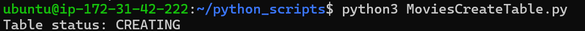

And we can see all existing table by running these python statements:

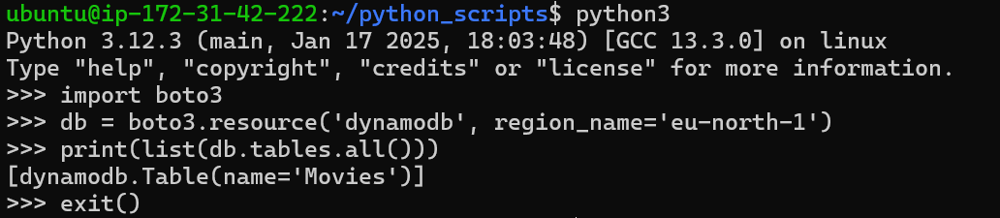

If we run the script again, we get an error stating that the "Movies" table already exists:

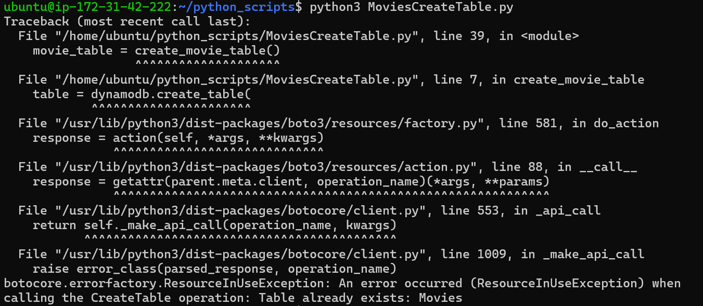

If we have multiple python functions and multiple scripts running on the EC2 instance, each acessing DynamoDB with `resource('dynamodb')`, then they are all accessing the same instance of the databse. This would also be the case if we shared the same IAM role with several different EC2 instances.

We also often want to load a bunch of items into an existance table at the same time. We can do this by providing the items to Boto3 in JSON format:

This is the JSON format used:
```json
[
    {
        "year" : ... ,
        "title" : ... ,
        "info" : { ... }
    },
    {
        "year" : ...,
        "title" : ...,
        "info" : { ... }
    },

    ...
]
 ```

 This is an example of a single data item:
 ```json
{
    "year": 2013,
    "title": "Rush",
    "info": {
        "directors": ["Ron Howard"],
        "release_date": "2013-09-02T00:00:00Z",
        "rating": 8.3,
        "genres": [
            "Action",
            "Biography",
            "Drama",
            "Sport"
        ],
        "image_url": "http://ia.media-imdb.com/images/M/MV5BMTQyMDE0MTY0OV5BMl5BanBnXkFtZTcwMjI2OTI0OQ@@._V1_SX400_.jpg",
        "plot": "A re-creation of the merciless 1970s rivalry between Formula One rivals James Hunt and Niki Lauda.",
        "rank": 2,
        "running_time_secs": 7380,
        "actors": [
            "Daniel Bruhl",
            "Chris Hemsworth",
            "Olivia Wilde"
        ]
    }
}
 ```

Included is a data file `moviedata.json` containing a few thousand movies. I moved this to my EC2 instance using FileZilla.

There is also a `MoviesLoadData.py` file which we can execute to load the data from the json file into the database:

```python
from decimal import Decimal
import json
import boto3
def load_movies(movies, dynamodb=None):
    if not dynamodb:
        dynamodb = boto3.resource('dynamodb', region_name='eu-north-1')
    table = dynamodb.Table('Movies')
    for movie in movies:
        year = int(movie['year'])
        title = movie['title']
        print("Adding movie:", year, title)
        table.put_item(Item=movie)
if __name__ == '__main__':
    with open("moviedata.json") as json_file:
        movie_list = json.load(json_file, parse_float=Decimal)
    load_movies(movie_list)

```

We can also create, read, update and delete items.

We can add a new data item into an existing table by providing the primary key and associated data. For example:

```python
from pprint import pprint
import boto3

def put_movie(title, year, plot, rating, dynamodb=None):
    if not dynamodb:
        dynamodb = boto3.resource('dynamodb', region_name='eu-north-1')

    table = dynamodb.Table('Movies')
    response = table.put_item(
       Item={
            'year': year,
            'title': title,
            'info': {
                'plot': plot,
                'rating': rating
            }
        }
    )
    return response


if __name__ == '__main__':
    movie_resp = put_movie("The Big New Movie", 2015,
                           "Nothing happens at all.", 0)
    print("Put movie succeeded:")
    pprint(movie_resp)

```

As usual, we run the script to create the item:

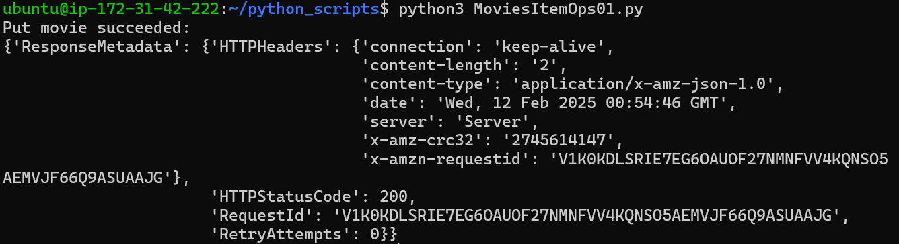

We can read an item from a table by using its primary key value using the `get_item()` function:

```python
from pprint import pprint
import boto3
from botocore.exceptions import ClientError


def get_movie(title, year, dynamodb=None):
    if not dynamodb:
        dynamodb = boto3.resource('dynamodb', region_name='eu-north-1')

    table = dynamodb.Table('Movies')

    try:
        response = table.get_item(Key={'year': year, 'title': title})
    except ClientError as e:
        print(e.response['Error']['Message'])
    else:
        return response['Item']


if __name__ == '__main__':
    movie = get_movie("The Big New Movie", 2015,)
    if movie:
        print("Get movie succeeded:")
        pprint(movie)

```

We need to deal with exception handling, i.e. if the item doesn't exist, we need to display a proper error message. This is very useful when debugging the code.

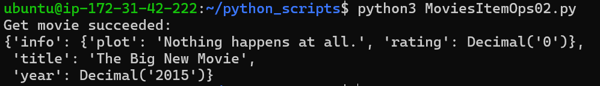

We can update an item in a table using the `update_item()` function, where again, we need to supply the primary key.

Consider the below that shows the existing item and the version we want to update it with.

```python
#existing item
{
    year: 2015,
    title: "The Big New Movie",
    info: {
        plot: "Nothing happens at all.",
        rating: 0
    }
}
#required updated version
{
    year: 2015,
    title: "The Big New Movie",
    info: {
        plot: "Everything happens all at once.",
        rating: 5.5,
        actors: ["Larry", "Moe", "Curly"]
    }
}
```

We see that we have modified the plot and rating and we have added a new list attribute, *actors*.

Using `update_item()` we can modify the values of existing attributed in item, add attributes to the item or remove attributs from the item.

This code accomplishes the above task:

```python
from decimal import Decimal
from pprint import pprint
import boto3


def update_movie(title, year, rating, plot, actors, dynamodb=None):
    if not dynamodb:
        dynamodb = boto3.resource('dynamodb', region_name='eu-north-1')

    table = dynamodb.Table('Movies')

    response = table.update_item(
        Key={
            'year': year,
            'title': title
        },
        UpdateExpression="set info.rating=:r, info.plot=:p, info.actors=:a",
        ExpressionAttributeValues={
            ':r': Decimal(rating),
            ':p': plot,
            ':a': actors
        },
        ReturnValues="UPDATED_NEW"
    )
    return response


if __name__ == '__main__':
    update_response = update_movie(
        "The Big New Movie", 2015, 5.5, "Everything happens all at once.",
        ["Larry", "Moe", "Curly"])
    print("Update movie succeeded:")
    pprint(update_response)

```

In this code we use the parameter `UpdateExpression` and the content assigned to this describes the changes we want to see in the specified item.

We first write the expression in terms of placeholder values (this is `:r`, `:p` and `:a`) and we then specify these values in the `ExpressionAttributeValues` parameter.

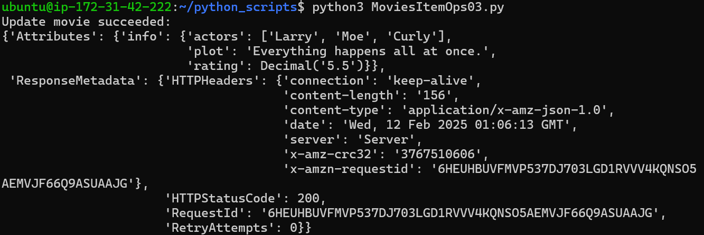

We also may want to delete an item using its primary key and we can do that with the `delete_item()` function.

In this case we use a `ConditionExpression` parameter which works in a very similar way to the `UpdateExpression` parameter, whereby a specific condition has to be satisfied for the update to occur.

```python
from decimal import Decimal
from pprint import pprint
import boto3
from botocore.exceptions import ClientError


def delete_underrated_movie(title, year, rating, dynamodb=None):
    if not dynamodb:
        dynamodb = boto3.resource('dynamodb', region_name='eu-north-1')

    table = dynamodb.Table('Movies')

    try:
        response = table.delete_item(
            Key={
                'year': year,
                'title': title
            },
            ConditionExpression="info.rating <= :val",
            ExpressionAttributeValues={
                ":val": Decimal(rating)
            }
        )
    except ClientError as e:
        if e.response['Error']['Code'] == "ConditionalCheckFailedException":
            print(e.response['Error']['Message'])
        else:
            raise
    else:
        return response


if __name__ == '__main__':
    print("Attempting a conditional delete...")
    delete_response = delete_underrated_movie("The Big New Movie", 2015, 10)
    if delete_response:
        print("Delete movie succeeded:")
        pprint(delete_response)


```

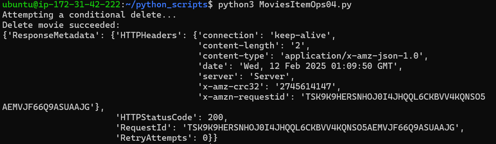

We may also want to query data from a table, and we do this using the `query` method. For this, we must supply the partition key to the query method. The sort key is optional.

For exapmle, if we supplied onto the year, we would return all movies of that year. If we supply the year and title then we retrieve the one specific movie with that year and title.

Here is an example of a query to get all movies released in a year:

```python 
import boto3
from boto3.dynamodb.conditions import Key

def query_movies(year, dynamodb=None):
    if not dynamodb:
        dynamodb = boto3.resource('dynamodb', region_name='eu-north-1')

    table = dynamodb.Table('Movies')
    response = table.query(
        KeyConditionExpression=Key('year').eq(year)
    )
    return response['Items']


if __name__ == '__main__':
    query_year = 1985
    print(f"Movies from {query_year}")
    movies = query_movies(query_year)
    for movie in movies:
        print(movie['year'], ":", movie['title'])

```

In the above, we use the parameter `KeyConditionExpression` instead of `ConditionExpression`. Also note the use of function `Key()`. The Boto3 SDK automatically constructs a `ConditionExpression` for us when we use the `Key()` or `Attr()` function. Of course we can specify a `ConditionExpression` directly as a string as in the case when we were deleting an item.

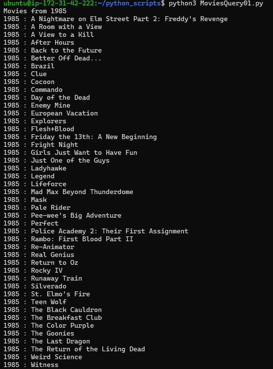

Here is another example that queries movies from 1992 with titles beginning with letters A-L.

```python
from pprint import pprint
import boto3
from boto3.dynamodb.conditions import Key


def query_and_project_movies(year, title_range, dynamodb=None):
    if not dynamodb:
        dynamodb = boto3.resource('dynamodb', region_name='eu-north-1')

    table = dynamodb.Table('Movies')
    print(f"Get year, title, genres, and lead actor")

    # Expression attribute names can only reference items in the projection expression.
    response = table.query(
        ProjectionExpression="#yr, title, info.genres, info.actors[0]",
        ExpressionAttributeNames={"#yr": "year"},
        KeyConditionExpression=
            Key('year').eq(year) & Key('title').between(title_range[0], title_range[1])
    )
    return response['Items']


if __name__ == '__main__':
    query_year = 1992
    query_range = ('A', 'L')
    print(f"Get movies from {query_year} with titles from "
          f"{query_range[0]} to {query_range[1]}")
    movies = query_and_project_movies(query_year, query_range)
    for movie in movies:
        print(f"\n{movie['year']} : {movie['title']}")
        pprint(movie['info'])

```

Here are a few (not all) of the movies this returns:

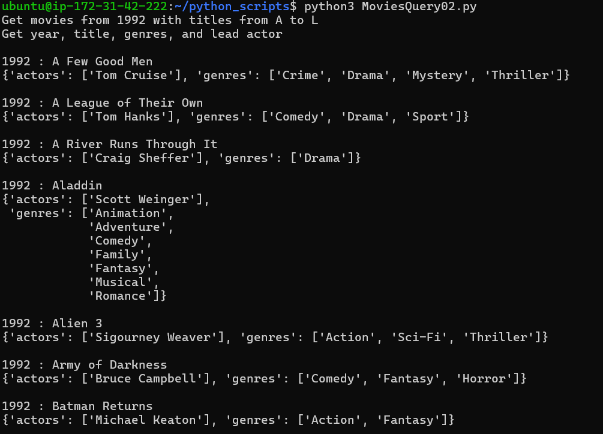

If we now remove the first two parameters:
```python
ProjectionExpression="#yr, title, info.genres, info.actors[0]",
ExpressionAttributeNames={"#yr": "year"},
```

Now we return all attributes of each movie item instead of just `yr`, `title`, `info.genres` and `info.actors[0]`:

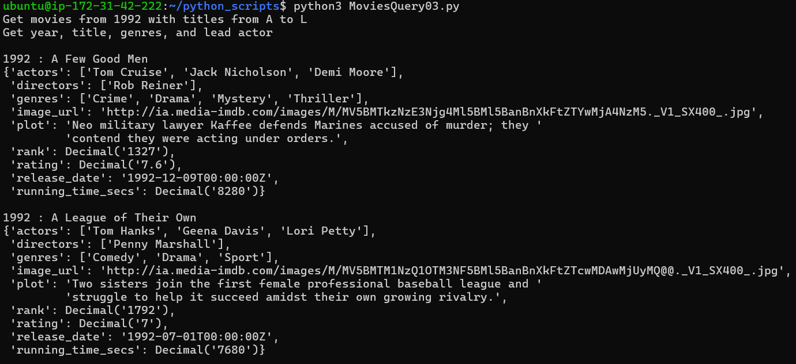

One limitation of the `query` method is that it must be supplied with a specific partition key value. We sometimes want to write a query that fetches data from multiple partitions; e.g. query movies between 1950 and 1959. 

For these queries, we can use the `scan` method which reads all items of the table from all partitions and applies a `FilterExpression` which only retuens the elements we want.

```python

from pprint import pprint
import boto3
from boto3.dynamodb.conditions import Key


def scan_movies(year_range, display_movies, dynamodb=None):
    if not dynamodb:
        dynamodb = boto3.resource('dynamodb', region_name='eu-north-1')

    table = dynamodb.Table('Movies')

    #scan and get the first page of results
    response = table.scan(FilterExpression=Key('year').between(year_range[0], year_range[1]));
    data = response['Items']
    display_movies(data)

    #continue while there are more pages of results
    while 'LastEvaluatedKey' in response:
        response = table.scan(FilterExpression=Key('year').between(year_range[0], year_range[1]), ExclusiveStartKey=response['LastEvaluatedKey'])
        data.extend(response['Items'])
        display_movies(data)

    return data

if __name__ == '__main__':
    def print_movies(movies):
        for movie in movies:
            #print(f"\n{movie['year']} : {movie['title']}")
            #pprint(movie['info'])
            pprint(movie)

    query_range = (1950, 1959)
    print(f"Scanning for movies released from {query_range[0]} to {query_range[1]}...")
    scan_movies(query_range, print_movies)

```

We retrieve the results of the scan in a slightly different way. DynamoDB applies and returns the results of queriers scanning one page at a time where a page can contain a maximum of 1MB of data (this is the concept of pagination).

The `response` object maintains the attribute `LastEvaluatedKey` which is not `None` if there are more pages following the current one.

The epxression `ExclusiveStartKey=response['LastEvaluatedKey']` points the `ExclusiveStartKey` to the top of the page and this is where the scanning process always begins.

Finally, we may want to delete an entire table from the database:

```python
import boto3

def delete_movie_table(dynamodb=None):
    if not dynamodb:
        dynamodb = boto3.resource('dynamodb', region_name="eu-north-1")

    table = dynamodb.Table('Movies')
    table.delete()


if __name__ == '__main__':
    delete_movie_table()
    print("Movies table deleted.")

```

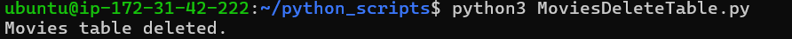